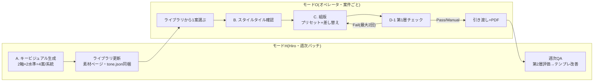
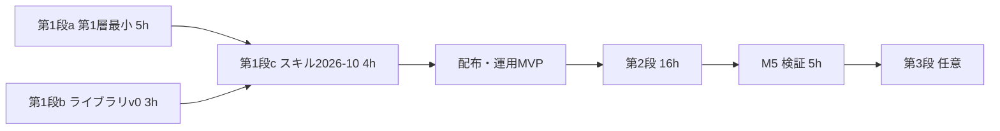

# パンフレット生成パイプライン改善計画書 (v2, 2026-09-25)

v1(2026-09-24)に対する4観点レビュー(技術実現性 / デザイン品質・ハーネス / 印刷入稿・ライセンス / 運用・コスト)の指摘を統合した改訂版。v1からの最大の変更は3点: (1)オペレータは生成しない(Hiroが作るキービジュアル・ライブラリから選ぶ)、(2)表1面に限り構図プリセットを開放する、(3)入稿寸法を3層で定義しPDF書き出し工程を設計に含める。

## 0. 前提と用語

- **モードH**: Hiroが Claude Code + Figma MCP + Gemini API で実行。フル自動、サブエージェント可、シェル可。
- **モードO**: コールセンターのオペレータ(最大9名、Figma・Claude初見、シフト制)が Claude web + Figmaコネクタで実行。シェルなし、外部POST不可、サブエージェントなし。
- **面(フェイス)**: A4シート(作業寸法1691×2392px、折り線 y=1196)を二つ折りしたA5面(210×148.5mm)。表紙フレームは 表1(表紙)+表4(裏表紙、180°回転)、中面フレームは 表2+表3。系統ごとの面の向き・回転はM0で表に固定する。
- **層0/層1/層2**: 層0=不変(寸法・折り・塗り足し・本文の書体/サイズ/行間・固定ブロック)、層1=制約付き可変(表1の構図プリセット)、層2=自由可変(色・見出し書体・装飾・イラスト = tone.json)。
- **px換算**: 係数 `k = min(frame.width, frame.height) / 210` [px/mm]。冊子フレームでは k≈8.05、1pt≈2.84px、3mm≈24px、8mm≈64px。乗降スポット表(794×1123)は k≈3.78。しきい値は必ずkから算出する。

## 1. 目的と成功基準

figma-pamphletの叩き台を「修正前提の下書き」から「初見で『おっ』と言わせる完成度70%の初稿」に引き上げる。驚きの源泉は(a)キービジュアルの面積と裁ち落とし、(b)タイトルの大きさと位置、(c)余白配分、(d)大面積の色面であり、書体・装飾・小イラストは補助。この4点を表1面の構図プリセットとキービジュアルで動かし、本文・寸法・折り位置は一切触らない。

| # | 基準 | 目標値 | 測り方 |
|---|---|---|---|
| S1 | 独立LLM評価者のルーブリック加重平均 | 4.0以上、R2≥4、R3≥3、**かつ現行版比+0.8以上** | フェーズD第2層のJSON(現行版と新版を同じ評価者・同じ較正で採点) |
| S2a | 発注者選好(Cicacメンバー5名以上×案件3件=15判定) | 新版12/15以上(p≈0.018) | ブラインド、左右入替、質問は「配布するならどちらか」 |
| S2b | 読者適合(65歳以上3〜5名) | 5秒提示で「何をしてほしいか」正答率と電話番号を指す所要秒数が新版≧旧版 | サービス地域住民または職員の親族。旧版が勝つ要素は驚きより優先 |
| S3 | 第1層(印刷・可読性)の残存Fail | 0件(Manualは引き渡しリストへ) | preflightの出力 |
| S4 | 1案件の所要(モードO) | **現行実測+20分以内、かつ画面外操作(保存・D&D・別タブ)は現行と同数(2回)以内** | M0で現行3案件を実測して分母を確定 |
| S5 | 追加コスト | 変動費300円/案件以内 **かつ** 新規サブスク固定費 月5,000円以内(v1はゼロ) | 課金ログ |

S1・S3は自動で毎回。S2a/S2bはM5で1回、以後四半期ごと。

## 2. 現状と課題

現行スキル(2026-08-20版)は「壊れない叩き台」を達成している。驚きに欠ける原因5つと、v2での解き方:

| # | 原因 | 現行の該当ルール | v2の解き方 |
|---|---|---|---|
| C1 | 骨格が毎回同じ | Step 2「テンプレートを複製してから編集」 | 表1面のみ構図プリセットK1〜K3(層1)を開放。中面は層2のみ |
| C2 | キービジュアルが無い | 利用者持ち込み素材を全点使う | Hiroが生成するキービジュアル・ライブラリ。持ち込みは写真(実車・実風景)に限定 |
| C3 | 色が1色相の濃淡のみ | 「メイン1色相の濃淡モデル」 | palette を役割分離(ground/main/main_tint/ink/cta/accent_decor)。ctaは電話・CTA専用 |
| C4 | 表現ルールが発動しない | 「フォント・サイズ・レイアウトは変えない」が優先 | 層の定義で解消: 層0は不変、層2はtone.jsonで必ず発動。装飾はテンプレの空プレースホルダ差し替え |
| C5 | 検証が「崩れの有無」だけ | Step 4 目視確認 | 第1層(コード)+第2層(独立評価者)。オペレータには○/✗要約のみ |

## 3. パイプライン全体像

原則: 驚きは画像モデルに、正確さは組版に、判定はコードと独立評価者に分担。**生成と評価はHiro(モードH)に寄せ、オペレータ(モードO)は「選ぶ・確認する」だけにする。**



| フェーズ | モードO(本線) | モードH |
|---|---|---|
| A. キービジュアル | ライブラリのスクショから番号で選ぶ(現行の色見本選択と同じ操作) | Gemini API(有料枠)で系統×2軸×2水準を生成、4Kマスター再生成、切り出し、upload_assets |
| B. トーン確定 | 同梱tone.jsonをスタイルタイル1枚で確認(「はい」のみ) | 画像からtone.json抽出→正規化→保存 |
| C. 組版 | 構図プリセット選択(表1)→色→見出し→文言→素材。装飾はプレースホルダ差し替え | 同じ+I1切り出し+I2ベクター(第3段) |
| D-1 第1層 | 自動。○/✗要約のみ表示。Failは自動修正2回、残りは引き渡しリストへ | 同じ(最大3回) |
| D-2 第2層 | **実行しない**。Hiroの週次QAへ | サブエージェント評価者、最大3周 |
| 引き渡し | 従来Step 5 + 残指摘 + ラッパー書き出し | 同じ |

成果物はすべてFigmaファイル内に残す: 案とライブラリは`素材`ページ、tone.json/状態は制作物フレーム直下の非表示テキストノード`#tone`/`#state`、生成物台帳は案件グループのテキストノード。

## 4. フェーズA: キービジュアル生成とライブラリ

### 4.1 生成(モードH、週次)

生成対象は「表1面(A5横または縦、系統の面表に従う)のキービジュアル」。文字は描かせない(タイトル帯の位置は無地で空ける)。

**因子設計(系統ごとに4案)**: 軸1=構図(全面ビジュアル / 余白+タイトル主役)× 軸2=描法(手描きの温かみ / フラットで明快)。4案すべてを「親しみ型・人物主役・暖色系ベース」の帯域内に収め、どれを選んでも読者適合は保証する。選定理由から構図と描法を分離でき、「Aの構図でBの描法」は1回の再生成で済む。

**プロンプト構造**:
1. 役割: 地域交通の高齢者向けパンフレットを手がけるアートディレクター
2. 案件: 地域名・サービス名・事業者・読み手(70代中心と家族)・ゴール行動(LINE登録、電話は補助)
3. 必須要素: 顔のある人物1体以上(読み手と同属性、電話をかける/乗車する姿、記号化しない)、乗合タクシー(白いワゴン、**右ハンドル・左側通行**)、地域モチーフ1つ(実在の山・川・名所)、受話器またはLINEのアイコン
4. 因子: 構図(上記)、描法(上記)
5. 制約: 面比率(例 210:148.5)、タイトル帯の位置は無地、文字を描かない、写実禁止、3Dレンダ調禁止、メーカーロゴ・看板・偽QR・電話番号らしき数字を描かない、着物・杖・白髪だけの高齢者記号化禁止、富士山+桜+鳥居の混合禁止、紫→青グラデ禁止
6. 参照(自社権利物のみ): 表1面のマスク画像(文字ゾーン白塗り)、指定色チップ、実車両写真、地域の実風景写真。**完成見本・持ち込み素材(ソコスト等)は絶対に渡さない**(規約違反)
7. 出力: 2K、PNG

**採用後**: 同方向で4K・文字なし・単色背景(#00FF00)のマスターを1枚再生成 → キー抜き+エッジ収縮で実alphaのPNG化(Gemini系は真のalphaを出さない) → 人物・車両の切り出し済み素材も同時に用意。

**投入(モードHのみ)**: 出力→curl→`upload_assets(count=N, currentPageId=素材ページ)`→POST→use_figmaで案件/ライブラリグループへ移動・番号ラベル・`#tone`同梱。

### 4.2 ライブラリ(素材ページ)

- 構成: 系統(あいとま/那智勝浦/登別/MITT)×構図2×描法2 = 各系統4点、初版は計12〜16点。各点に tone.json(最小版)と切り出し済み人物・車両を同梱。
- 案件固有の生成(依頼文に「ライブラリ外の希望」がある場合)はHiroの週次バッチで対応。月10件超の月はライブラリ更新頻度を上げる。
- 不採用案・旧版は「案」サブグループに残す(参照用)。

### 4.3 選び方(モードO)

1. スキルがライブラリの該当系統4案を1枚のスクショにして提示(番号付き、注記「雰囲気の見本です。文字と細かい配置は変わります」)
2. 消去法で選ぶ: まず一番合わないものを外す→残りから選ぶ
3. 観点3つ: 「この絵の中にうちの地域の利用者がいると感じるか」「70代の親に渡して『いいね』と言われそうか」「他の案より"この町らしい"か」
4. 理由を一言で記録(`#tone`の`meta.operator_choice.reason_verbatim`)。「どれも違う」はHiroへの生成依頼として運用ログに記録し、当面は最も近い案で続行

## 5. フェーズB: トーンの言語化(tone.json v2)

形容詞を「面座標のmm・hex・enum・比率」に落とす。各ブロックの消費者(変換表 / イラストブリーフ / 第1層 / 評価者)を明示し、死んだデータを持たない。

```json
{
  "schema_version": "tone/2",
  "meta": {
    "template_family": "あいとま系",
    "faces": {"cover": {"name":"表1","size_mm":[210,148.5],"rotated_in_frame":false},
              "back": {"name":"表4","size_mm":[210,148.5],"rotated_in_frame":true}},
    "px_per_mm": 8.05,
    "locked": {"brand_palette": false, "body_typography": true, "fold_and_bleed": true,
               "fixed_blocks": ["発行者情報","電話ブロック","QR"]},
    "operator_choice": {"selected_option": 2, "reason_verbatim": "山と車が見えて、うちの地域っぽい"}
  },
  "direction": {"label":"あたたかい手描き","one_liner":"クリーム地に朱色の帯、丸ゴシックの大見出し、榛名山と実車を主役に",
                "mood_words":["あたたかい","ご近所","手を差し伸べる"]},
  "composition": {
    "cover_preset": "K2_top_visual",
    "hero": {"area_ratio_of_face": 0.55, "bleed_sides": ["top","left","right"], "crop_focus": "person_and_vehicle"},
    "title": {"placement": "bottom_left", "max_width_ratio": 0.7},
    "cta_block": {"placement": "bottom_right", "panel": "solid"},
    "outer_margin_mm": 10
  },
  "palette": {
    "roles": {"ground":"#FBF3E6","main":"#C24A1E","main_tint":"#F6D6C8","panel":"#FFFFFF","ink":"#231815",
              "cta":"#C8102E","cta_text":"#FFFFFF","accent_decor":"#2E7D5B"},
    "cta_slots": ["電話番号","CTAボタン"], "accent_decor_slots": ["バッジ"],
    "illustration_palette": ["#C24A1E","#F6D6C8","#2E7D5B","#F2C9A0","#231815"],
    "print": {"max_saturation_large_fill": 0.80, "min_tint_pct": 5, "gradients_allowed": false}
  },
  "typography": {
    "headline_preset": "H1_round_black_horizontal_2tone",
    "headline": {"family":"Zen Maru Gothic","weight":"Black","size_mm_range":[14,20],"line_height":1.25,
                 "tracking_pct":-2,"treatment":"solid_on_panel",
                 "two_tone":{"enabled":true,"colors":["#231815","#C24A1E"]},
                 "effects":{"outline":{"enabled":false,"max_ratio_of_size":0.06},"shadow":{"enabled":false}}},
    "numerals": {"family":"Noto Sans JP","weight":"Black","phone_min_ratio_to_body":3.0,"tilt":"none"},
    "body": {"locked_by_template": true, "allowed_families": ["Noto Sans JP","BIZ UDPGothic"], "min_pt": 12}
  },
  "decoration": {
    "signature_element": "tilted_band",
    "signature_params": {"rotation_deg": -4, "max_chars": 8, "text_rotates_with_band": true},
    "budget": {"max_devices_per_face": 3, "max_shape_patterns": 3},
    "corner_radius_mm": {"small": 2, "large": 6}, "shadow_policy": "none",
    "background": {"type": "flat", "gradient": null},
    "no_go_zones": ["fold_8mm","trim_3mm","body_text_boxes","phone_and_qr"]
  },
  "illustration": {
    "source_policy": "single_source", "source": "library_nbp_master_4k",
    "style": {"rendering":"flat_vector_thick_outline","outline_mm":0.6,"shading":"none","background":"transparent"},
    "subjects": [
      {"id":"hero_person","desc":"70代女性、受話器を持って穏やかに笑う","facing":"toward_cta","placeholder":"#人物"},
      {"id":"vehicle","desc":"白いワゴン型乗合タクシー、右ハンドル","placeholder":"#車両"},
      {"id":"local_motif","desc":"榛名山のシルエット","placeholder":"#地域モチーフ"}],
    "min_effective_dpi": 200,
    "photos": {"allowed": true, "use": "実車・実風景のみ。中面の信頼ブロック限定。イラストと同一面に混ぜない"}
  },
  "avoid": {
    "generation": ["3d_pixar_render","glossy_skin","left_hand_drive","kimono_elderly","cane_white_hair_only",
                   "fuji_sakura_torii_mix","fake_logos_qr_digits","english_heavy","photo_realism","purple_blue_gradient"],
    "layout": ["multiple_text_effects_on_one_text","tilted_body_or_numbers","text_over_image_without_panel",
               "rainbow_or_diagonal_gradient_bg","more_than_2_font_families","exclamation_star_overuse",
               "box_everything","reversed_white_small_text"]
  },
  "provenance": {"composition.cover_preset":"operator","palette.roles.main":"image","palette.roles.cta":"rule",
                 "typography.headline.family":"default","decoration.signature_element":"image"},
  "consumers": {
    "figma_conversion": ["composition","palette.roles","typography.headline","typography.numerals","decoration","illustration.subjects"],
    "illustration_brief": ["illustration","palette.illustration_palette","avoid.generation","direction.mood_words"],
    "preflight": ["palette.print","typography.body","typography.headline.effects","decoration.budget","decoration.no_go_zones","illustration.min_effective_dpi","avoid.layout"],
    "evaluator_stage2_R5": ["direction","palette.roles","typography.headline","illustration.style","provenance"]
  }
}
```

**抽出と正規化(モードH)**:
1. 採用画像+ブリーフを渡し「画像に見えるものだけ記述、見えないものは`provenance: default`で既定値表から埋める」で初稿
2. 正規化: `palette.roles.main/main_tint`は既存の濃淡2群置換へ。`main`は白文字を載せるなら白との比≥4.5:1まで暗くする(例 #D9542B→#C24A1E)。`ground`は淡色地の網点下限(5%)以上。`locked.brand_palette=true`(MITT系)はmain/main_tintをテンプレ値で上書き。`headline.family`はフォント許可リスト(6.5)へマッピング。`signature_element`は1つ
3. **スタイルタイル**: パレットチップ・実タイトルを見出し書体で実寸組み・signature要素・キービジュアル縮小を1フレームにまとめ、スクショで確認(モードOでは「はい」だけ)。確認文で`provenance: default`の項目(「こちらで仮に決めた点: 見出し書体・帯の形」)を明示
4. 保存: 制作物フレーム直下に非表示・ロック済みTEXTノード`#tone`(フォントはNoto Sans JP Regular固定)。素材ページの案件グループにも複製。**FrameNodeにdescriptionは書けない(COMPONENT専用)・setPluginDataはuse_figmaで禁止**のため、この方式に固定

## 6. フェーズC: 組版

### 6.1 3層の定義(現行「差し替えの約束事」の改訂)

| 層 | 対象 | 変更可否 |
|---|---|---|
| 層0 不変 | フレーム寸法・折り位置・塗り足し、本文/注記の書体・サイズ・行間・位置、固定ブロック(発行者情報・電話ブロック・QR)の位置 | 変えない(現行どおり) |
| 層1 構図(表1のみ) | 構図プリセットK1〜K3から選ぶ。プリセット内でタイトルサイズ±20%・左右寄せ・ヒーローの切り抜き位置・余白2段階だけをパラメータとして許す | プリセットはHiroが事前設計し印刷安全域を検証済み。LLMは幾何を発明せず「選ぶ」 |
| 層2 表層 | 色(役割分離)、見出し書体・プリセット、装飾(プレースホルダ差し替え)、イラスト | tone.jsonに従って必ず変える |

**構図プリセット(表1)**: K1 全面ビジュアル+無地の文字帯 / K2 上ビジュアル55〜60%+下情報(現行相当) / K3 タイトル主役+人物1体+余白多め。**見出しプリセット**: H1 太丸ゴ横組み2色 / H2 角ゴ極太縦組み+左人物 / H3 手書き風横組み+傍点。テンプレ4系統×K1〜K3をM2で作る(初版はK2のみで運用開始し、K1・K3は第2段で追加)。

### 6.2 装飾はプレースホルダ差し替えで発動する

テンプレに装飾用の空レイヤーを事前配置し(`#キービジュアル` `#帯` `#背景` `#バッジ`)、実行時は新規ノード生成をしない。理由: (a)180°回転面での新規追加はfigma-ops.mdが避けるべきとしている、(b)折り位置・塗り足しの侵犯をテンプレ側で構造的に防げる、(c)モードOで失敗の説明が不要になる。v1(第1段)の装飾は表紙面のみ。中面は色・見出し書体の変更に限定。

**装飾の配置規則**(P5/P6/P18で機械判定):
1. 表紙フレームでは装飾は面ごとに完結。折り線(y=1196)±24pxの帯には装飾・文字を置かない。中面は背景・イラストのまたぎ可、文字は±64px(8mm)禁止
2. 折り線±24pxに相対輝度0.2未満のベタを置かない(背割れ)
3. 装飾の辺は「仕上がり端から≥24px内側」か「≥24px外側まで延長」のどちらか(端ピタ禁止)
4. 帯内テキストは帯と一緒に回転(グループ化)、文字数≤8。本文・電話番号・QR説明は絶対に傾けない
5. 背景は既定フラット。グラデはtone.jsonで明示された場合のみ、階調差15%以上・長さは面の30%以内
6. 1テキストに効果(フチ・影・グラデ)は1種まで。1面の装飾は3種まで

### 6.3 tone.json → Figma操作の変換表

| tone.json | Figma操作(use_figma) | 注意 |
|---|---|---|
| composition.cover_preset | 系統×プリセットのテンプレを複製(現行Step 2と同じ) | 表1のみ。中面は系統の標準 |
| palette.roles.main / main_tint | 既存の濃淡2群一括置換。IMAGE fillは対象外 | 色一致は許容差1/255。TEXTは`getStyledTextSegments(['fills'])`→`setRangeFills` |
| palette.roles.cta | `#電話` `#CTA`のfillのみ | 高さ8mm以上の数字のみ。7:1未満なら数字はink、ラベルのみcta |
| palette.roles.accent_decor | `#バッジ`のfillのみ | |
| typography.headline_preset / family | `#見出し`系のfontNameを許可リスト内で置換。本文は触らない | 全フォントを重複排除して`Promise.all(loadFontAsync)`。`hasMissingFont`は先にフォールバック |
| headline.effects.outline | stroke(白 or ink、OUTSIDE、`strokeJoin='ROUND'`、太さ=最大fontSize×0.06) | 混在サイズは最大値基準。白文字には白フチを付けない |
| decoration.signature_element | `#帯`プレースホルダを表示・fill・relativeTransformで中心回転 | 新規createNodeFromSvgはしない |
| decoration.background | 面ごとの`#背景`のfillをground色に | フレームfillではなく面の背景矩形 |
| illustration.subjects | `#キービジュアル` `#人物` `#車両`にライブラリ素材をclone→`imageHash`をfillに(ラスター)、またはFRAMEの子に(ベクター) | 重ね置きしたcloneは削除。`scaleMode: FIT` |

探索は制作物フレームを起点に`frame.findAll(n => n.name.startsWith('#'))`を1回だけ実行し`{name→id[]}`を返して以後はID指定。`figma.root.findAll`は使わない。

### 6.4 イラスト投入経路

| 経路 | モード | 生成 | 投入 | 用途 |
|---|---|---|---|---|
| I0 ライブラリ | O/H | Hiroの週次バッチ(4.1) | 素材ページからclone(既存の手段A) | キービジュアル・人物・車両(本線) |
| I1 案件固有の切り出し | H | 4Kマスター→キー抜き | curl→upload_assets(PNG, scaleMode FIT) | ライブラリ外の希望がある案件 |
| I2 ベクター(Recraft V4 Styles Vector) | H(第3段) | I1をスタイル参照にSVG生成 | upload_assets(SVG)→FRAMEの子へ移動 | ワンポイント・アイコン群 |
| I3 持ち込み | O/H | 利用者 | 従来どおり | **写真(実車・実風景)に限定**。中面の信頼ブロック。イラストと同一面に混ぜない |

**1紙面1ソース原則**: イラストは同一経路のものだけを使う(トーン混在の主因を断つ)。持ち込みイラストがある場合は「写真に差し替える」か「ライブラリを使わず持ち込みだけで作る(現行方式)」のどちらかを確認する。

### 6.5 フォント許可リスト

- 許可: Noto Sans JP / BIZ UDPGothic / BIZ UDGothic / Zen Maru Gothic / Zen Kaku Gothic New / M PLUS Rounded 1c / M PLUS 1p(いずれもGoogle Fonts・OFL・Figma標準搭載・PDF書き出しでglyph化)
- **本文・注記・固有名詞(地名・サービス名・電話番号)はNoto Sans JPまたはBIZ UDPGothicのみ**(JIS第2水準・UD)。装飾書体は`#見出し`系に限定
- フォールバック: 見出し=Noto Sans JP Black、本文=BIZ UDPGothic
- M0で`listAvailableFontsAsync()`の実出力からfamily/style名を写し、テンプレート・参照ページを含む全TEXTの非Google Fontsを0にする
- 見出し書体変更後はget_screenshotで欠字・混植を目視(P8-b)

### 6.6 入稿PDFの生成(寸法の3層定義)

FigmaのPDF書き出しは1px=1pt・1xのみ。1691×2392pxをそのまま書き出すと596.5×843.8mm・塗り足しゼロになる。

| 層 | 寸法 | 役割 |
|---|---|---|
| 作業寸法 | 1691×2392px(横型は2392×1691) | テンプレ・参照と同一。resize禁止は維持 |
| 書き出しラッパー | 1739.3×2440.3px(四辺+24.16px=3mm) | `書き出し`ページの空フレーム(clipsContent=true、fill=ground)に制作物フレームのクローン(clipsContent=false)を(24.16,24.16)に入れ、`rescale(595.276/1691=0.35204)` |
| 入稿寸法 | 216×303mm(トンボなし) | ラッパーをPDF(画質High)で書き出し |

- 既定はsRGBのままPDF→RGB入稿可の印刷会社(ラクスル等)へ。PDF/X-1a・CMYK必須の会社のみAcrobat Pro/Illustratorで変換(Japan Color 2001 Coated)。TinyImageでのCMYK変換は使わない(プロファイル不明・DPI順序依存)
- 制作物フレームはclipsContent=false(塗り足し要素をフレーム外へ延ばす)。トンボはデータ内に描かない
- 中期: 次回テンプレ改修時に1pt=1px(595.28×841.89+裁ち落とし)へ作り直し、以後のしきい値をpt直値にする
- ラッパー作成・rescaleはスキルが自動で行い、Export操作(PDF, High)だけを人が行う

### 6.7 スキル改訂点(figma-pamphlet 2026-10版)

| 場所 | 改訂 |
|---|---|
| Step 0 | `テンプレート`ページの非表示ノード`#config`(`skill_min_version`, `pipeline: on/off`)と自版を照合。古ければ停止して更新依頼を表示。`pipeline: off`なら2026-08-20手順で動作(遠隔ロールバック) |
| Step 1 ヒアリング | 「生成AIイラスト使用の可否(自治体・事業者の内規)」を追加。素材の項目は「写真(実車・実風景)があれば」に変更 |
| Step 1.5 | 色見本選択→**ライブラリから選ぶ**(4.3) |
| 新Step 1.7 | スタイルタイル確認→`#tone`保存 |
| Step 2 | 系統×構図プリセットを複製。`#state`から再開可能に |
| Step 3 | 変換表(6.3)に従う。装飾はプレースホルダ差し替え |
| Step 4 | 第1層を自動実行。○/✗要約のみ表示。Failは自動修正2回、残りは引き渡しへ |
| Step 5 | ラッパー作成・rescale・残指摘・生成物台帳の確認・`#AI表記`の存在 |
| 新規 references/keyvisual.md | 4章・5章の手順、プロンプト、面表、フォントマッピング、ライブラリ運用 |
| 新規 references/preflight.md | 7章の仕様とスクリプト(逐語・≤25KB) |
| 新規 references/evaluator.md | 第2層のルーブリック・較正セット・Project設定(モードH/週次QA用) |
| template-and-assets.md | 3層定義、装飾の配置規則、入稿PDFの生成、フォント許可リスト、`#`命名規約 |

## 7. フェーズD: 自己検証(二層ハーネス)

### 7.1 第1層: 決定的チェック(preflight.js、use_figmaで実行)

対象フレームを走査し、Pass/Fail/**Manual**(要目視)の3値と該当ノードID・実測値・修正案をJSONで返す。実装上の共通ルール: フォントは先に全ロード、`figma.mixed`はセグメント単位、`hasMissingFont`はManual、`visible===false`と`#tone`/`#state`は除外、探索は制作物フレーム起点で1回、返却はFailのみ・1チェック最大20件・charactersは先頭15字(20KB上限)、P3は別呼び出し。しきい値は係数kから算出。

| ID | チェック | しきい値(高齢者向け、k≈8.05) | 判定 |
|---|---|---|---|
| P1 | 寸法3層 | 作業1691×2392 / ラッパー1739.3×2440.3(±0.5px) / PDF 216×303mm | 前2つはコード。PDF実寸は人手(モードH: pdfinfo) |
| P2 | 本文サイズ | `#本文`≥12pt(34px)、`#注記`≥10pt、全TEXT絶対下限6pt(17px)、白抜き≥8pt(23px) | セグメント走査 |
| P3-a | 文字あふれ | 0件 | `textAutoResize==='NONE'`のTEXTのみ。全フォントロード→clone→`'HEIGHT'`→高さ比較→remove |
| P3-b | はみ出し | 0件 | absoluteBoundingBoxが所属面・clipsContent祖先内か |
| P4 | コントラスト | 本文7:1、見出し4.5:1 | 背景候補=矩形を90%以上覆う可視ノードのうちDFS前順で手前の最上位。SOLID・不透明のみ計算、GRADIENT/IMAGE/半透明はManual。袋文字はstroke色で計算 |
| P5 | 塗り足し・端ピタ禁止 | 辺に接する要素は外側≥24px、非裁ち落とし要素(文字・QR・ロゴ)は内側≥24px。制作物フレームclipsContent=false | absoluteBoundingBoxと仕上がり矩形 |
| P6 | 折り安全域 | 文字が折り軸(長辺の中点)から≥64px。折り軸をまたぐ文字はFail | 装飾・背景は対象外 |
| P7 | 仮置き文言 | 0件 | `/[〇○◯]{2,}\|0000\|[（(]仮[)）]\|ダミー\|サンプル\|XXX\|TODO/i` |
| P8 | フォント | family完全一致(6.5)。本文・固有名詞はNoto Sans JP/BIZ UDPGothicのみ | 混植はP8-b人手 |
| P9-a | 印刷再現性 | HSVでS>0.85∧V>0.85∧色相170〜300°はFail。S>0.9∧V>0.95の暖色はFail。淡色地の最大チャンネル1〜4%はWarn | SOLID/GRADIENT stop |
| P9-b | avoid.layout | tone.jsonのavoidに該当するfill・効果 | |
| P10 | 人物 | `#人物`のimageHashがテンプレ原本と異なる OR 可視の子ノード≥1 | 原本hashはM1で採取 |
| P11 | QR | `#QR`短辺≥161px(2cm)、他ノードとの最小ギャップ≥16px(2mm) | 画像内部の余白は人手 |
| P12 | 電話番号 | `#電話`のfontSize ≥ 本文中央値×3 | |
| P13 | 画像解像度 | `dpi = 画像px ÷ 配置px × 204.5`。フラット≥200(Fail<150)、写真≥300(Fail<200)、QR≥300またはベクター | `getImageByHash(hash).getSizeAsync()`、scaleMode考慮 |
| P13-b | 切り抜きalpha | `#人物`等のPNGがalpha付き(IHDR color type 4/6)、または背景色=ground | `getBytesAsync()`でヘッダ判定 |
| P14 | 色数 | IMAGEと許可色の濃淡を除いた一意fill ≤4 | |
| P15 | 効果の重掛け | 1TEXTにstroke/shadow/gradientのうち2つ以上でFail | |
| P16 | 書体・線幅 | 書体ファミリ≤2。stroke≥1px、白抜き線≥2px | |
| P17 | 装飾数 | 1面の装飾ノード≤3、角丸半径の種類≤2 | |
| P18 | 折り線上の濃色ベタ | 折り軸±24pxに相対輝度<0.2の塗り→Warn | 背割れ |
| P19 | カラープロファイル | `figma.root.documentColorProfile==='SRGB'` | |
| P20 | 透明効果の棚卸し | effects/opacity<1/blendMode≠NORMALの一覧(報告のみ) | 人手で200%確認 |
| P21 | 機種依存文字 | `[①-⑳㈱㈲㈹℡㍻㍼髙﨑]`等0件 | |
| P24 | 出所 | 可視透かし付き(`#案_透かし有`)画像が制作物内に0件、生成物台帳ノードあり | 透かし自体の目視は人手 |
| P25 | AI表記 | `#AI表記`に固定文あり | 生成画像を使った場合のみ必須 |
| P26 | 書き出し設定 | PDF High、対象=ラッパー、ページ順(表紙面→中面) | UI設定のため人手 |

第1段(最初の2週間)で実装するのはP1(作業寸法)・P2・P3-a・P4(単色背景のみ)・P7・P12。残りは第2段。

### 7.2 第2層: LLM評価者(モードH / 週次QA)

- **実行主体**: モードHではサブエージェント(執筆側の思考・履歴を見ない)。モードOでは実行せず、Hiroが週次QAとしてClaude Project「パンフ評価者」(ルーブリック・較正例・チェックリスト・可変ノード一覧の書式を常備)で当週の制作物をまとめて採点し、指摘はテンプレ・変換表・ライブラリの改善に反映する
- **入力**: 面単位・正立のスクショ(表1は長辺1568pxで単独。評価者が自分で`get_screenshot(enableBase64Response=true)`を呼ぶ)、事実だけのブリーフ、ルーブリック、較正例、可変ノード一覧(名前+面座標mm+可変属性)。**tone.jsonは第2段まで渡さない**
- **較正セット(M0)**: (a)現行完成見本3枚 (b)他自治体・他事業者のプロ制作パンフ3枚(5点の基準) (c)意図的な失敗例3枚(1〜2点の基準)。2名以上が独立に採点し根拠文付きに。別の3枚(ホールドアウト)で評価者と人間の一致率(±1以内80%以上)を確認してから運用
- **手順**: (0)採点前に「プロのADなら直す点を3つ」を書く (1)G0欠陥ゲート (2)R1〜R4を既定3点から出発、4以上には画面上の観察を2つ引用 (3)tone.jsonと可変ノード一覧を開示しR5と修正指示 (4)チェックリスト該当IDを列挙
- **生成側にも事前に渡す**: フェーズC開始時にルーブリック本文とチェックリストを生成側に渡す(採点はさせない。装飾の装置名を褒め言葉に書かない)

| 項目 | 5点 | 3点 | 1点 | 減点トリガー |
|---|---|---|---|---|
| G0 欠陥ゲート(合否) | 生成画像に手指/顔/車両(ハンドル位置・ドア数)/画像内文字の破綻がなく、仮置き文言もない | — | — | 1件でも該当で不合格、再生成指示のみ |
| R1 親しみ・温度 | 顔のある人物が表1ビジュアルの1/3以上、地域の暮らしの中でゴール行動をしている。大面積の色が暖かい | 人物はいるが小さい/汎用的 | 人物なし、白地に箱の羅列、威圧的 | 同一笑顔のAI定型(−1)/着物・杖・白髪の記号(−1)/視線がCTAと逆(−0.5) |
| R2 行動の明快さ(ゲート、4未満は不合格) | 5秒で「電話する/LINE登録する」と言え、電話番号が本文の3倍以上で受付時間付き、QR2cm角以上+説明 | CTAが2つ同格で競合 | CTAが埋もれる | 本文・数字への袋文字・影・傾き(−1)/座布団なしの画像上文字(−1)/1面に3メッセージ以上(−1) |
| R3 固有性・非定型(対比評価) | 同系統の直近2件と並べて一目で別物、固有要素(実在の山・川・名所、実車、愛称)が本文以外に3つ以上 | 固有要素1〜2 | 地名を消せばどこでも使える | チェックリスト該当1件ごと(−0.5)/富士山+桜+鳥居(−1) |
| R4 クラフト | 最大要素が1つで2番目との差が明確、余白が3群以内、角丸・罫線・線幅が揃う | 均一サイズで主役不在 | 密集、端が揃わない | 効果2種以上(−1)/角丸不統一(−0.5)/1〜2mmのズレ3箇所以上(−1) |
| R5 統一感(第2段) | すべてのイラストが同一描法、色はtone.jsonの役割どおり、見出し書体は1種 | 描法の違う素材1点 | 描法の混在、面ごとに書体が違う | 持ち込み混在1点ごと(−0.5)/provenance=defaultは照合対象外 |

合格: R2≥4、R3≥3、加重平均(R1 .25/R2 .25/R3 .25/R4 .15/R5 .10)≥4.0、かつ現行版比+0.8以上。修正指示は`{"node":"#人物","face":"表1","severity":"must|should","targets":"R1","instruction":"…"}`を最大3件。不可変ノードへの要求は`handoff:true`で引き渡しリストへ。

### 7.3 ループ制御(モードH)

1. 各周の開始時にフレームを複製し`案件_表紙_r1/_r2/_r3`とする(Figma状態を上書きしない)
2. 組版→第1層(Failは自動修正、最大3回。残りはManual/引き渡し)→スクショ→第2層→上位3件修正→第1層から
3. 最大3周。採用は**最終周**を既定とし、前周比で加重平均が0.3以上下がった場合のみ前周に戻す
4. 早期停止: ピンポン(同一項目が交互に上位3に出る)/固定層要求(上位3がすべて不可変ノード)/平坦化(Δ<0.2かつ1点以上改善した項目なし)/装飾インフレ(装飾ノード数が周ごとに増える)/決定的退行(第1層Fail数が減らない)
5. 状態(周・スコア・解決済みリスト)は`#state`に保存し、次周の評価者に解決済みリストを渡す

## 8. 運用モード

### 8.1 モードO: オペレータの1案件(目標: 現行+20分以内、画面外操作2回)

1. 依頼文テンプレ(案件情報・作るもの・載せる内容・写真素材・色指定・イメージの希望)を貼る
2. ライブラリ4案のスクショから番号で選ぶ(消去法、理由一言)
3. スタイルタイルに「はい」
4. Claudeが複製→色→見出し→文言→素材→装飾を実行(自動)
5. 第1層の○/✗要約を読む(スコア・「不合格」の語は出さない)
6. 完了報告・残指摘リスト→Figmaで書き出しラッパーを選択→Export(PDF, High)
7. 画面外操作は「写真素材のD&D(あれば)」と「Export」の2回のみ

**エスカレーション**: 一次窓口=Cicac側リーダー1名(Figmaの選択・移動・文字編集・Exportの30分研修)。オペレータ向け「困ったときの1枚カード」: ①案が合わない→最も近い案で続行し運用ログに記録 ②✗が残る→引き渡しリストに載せて終了 ③Figmaコネクタが切れた→Claude設定で再接続、直らなければ翌日 ④「スキルが古い版」表示→リーダーへ ⑤会話が長すぎる/上限→新しいチャットで「続きから」(`#state`から復元)。全事象を運用ログ(Figma上の1フレーム)に1行記録し、Hiroが週1で確認。

### 8.2 モードH: Hiroの週次(1〜1.5h)

ライブラリ更新(必要な系統のみ)→週次QA(当週の制作物を第2層で採点)→指摘をテンプレ・変換表・ライブラリへ反映→運用ログ確認→`#config`更新。

### 8.3 切り替え基準・配布

- 新テンプレ系統・テンプレ改修・スキル版上げは必ずモードHで検証してから配布
- 配布はClaude Team組織スキルで一括(管理者=Cicac側、Hiroはzipを渡す)。個人アップロード禁止。旧zipは`参照`ページに日付付きで保管
- `#config`の`pipeline: off`で全員を2026-08-20手順へ即時ロールバック可能

### 8.4 教材への影響

ハンドブックの純増は+1ページ(「ライブラリから選ぶ」は現行「色を選ぶ」ページの差し替え)+1枚カード。説明会デモは変更スライド1枚。オペレータに見せない工程: tone.json、第1層の中身、評価スコア、ラッパー・rescale、版照合、AI表記の自動挿入。

## 9. 実装ロードマップ(3段階、合計約36h)

| 段 | 期間 | 内容 | 成果物 | 目安 |
|---|---|---|---|---|
| **第1段** | 2週(約12h) | (a)第1層最小版: P1作業寸法・P2・P3-a・P4単色・P7・P12を1スクリプトに、テンプレ4系統+完成見本で誤検知確認 (b)ライブラリv0: 系統×4案=12〜16枚+切り出し済み人物・車両、tone.json最小版同梱 (c)スキル小改訂2026-10版: ライブラリ選択・cta3箇所・見出し書体差替・表紙のみsignature・`#config`版照合とpipelineフラグ・`#tone`/`#state`再開 (d)現行フロー3案件の実測(S4分母) | preflight.md v0、ライブラリv0、スキル2026-10、実測値 | 価値は2週目から |
| **第2段** | 3〜6週(約16h) | P5・P6・P8・P9・P10・P11・P13〜P21、テンプレの`#`命名と装飾プレースホルダ、構図プリセットK1・K3と見出しプリセット、書き出しラッパー自動化、較正セット9枚+ホールドアウト、評価者Project(週次QA)、ハンドブック改訂、運用MVP | preflight.md v1、テンプレ改修、evaluator.md、教材 | |
| **M5 検証** | 第2段末(約5h) | 現行版vs新版をモック3件、S2a(5名×3件)・S2b(65歳以上3〜5名)、S1を同一評価者で | 検証レポート | 未達なら6.1〜6.3を優先修正 |
| **第3段(任意)** | 以降 | Weave連携(モードH)、Recraft I2(法人契約後)、案件個別生成、Claude+Gemini 2評価者、preflightのgenerative plugin化、テンプレの1pt=1px化 | | |

朝1〜1.5h/日(実効4.5〜6h/週)で、中断2週を含め約8週(11月中旬)。第1段と第2段の(a)〜(d)は並行可。



## 10. コスト・ライセンス・リスク

### 10.1 コスト

| 項目 | 単価(概算、要実測) | 使用量 | 月額 |
|---|---|---|---|
| Gemini API(gemini-3-pro-image、有料枠) 2K生成 | 約0.134ドル/枚 | ライブラリ更新12枚+編集6枚/月 | 約400円(Hiro側) |
| 4Kマスター再生成 | 約0.24ドル/枚 | 採用案のみ、4〜8枚/月 | 約150〜300円 |
| オペレータの変動費 | 0円 | — | 0 |
| 新規サブスク固定費 | v1はゼロ(Weave・Recraft・Google AI Proは契約しない) | — | 0 |

### 10.2 ライセンス早見表

| 画像ソース | 商用 | 自治体配布物 | 注意 |
|---|---|---|---|
| Nano Banana Pro(Gemini API/AI Studio 有料枠) | 可(Googleは所有権を主張しない) | 可。内規確認+AI表記推奨(東京都手引き) | 同一・類似出力が他者にも生成され得る/知財補償なし/著作物性が否定され得る(独占不可)/SynthID(不可視) |
| Geminiアプリ(無料・AI Pro) | 可視透かし付き | **不可**(透かし、学習対象) | 案の比較・検討のみ。透かし除去は来歴偽装に当たり得る |
| Recraft V4(有料/API) | 可(全権利ユーザー) | 可(内規確認) | 権利は生成時点で確定。無料プランは不可。v1では不採用 |
| Weave経由 | 価格ページ上は商用可 | **要検証**(Weave ToS本文未確認) | 配布前に規約を保存。v1では不採用 |
| ソコスト / ちょうどいいイラスト / unDraw / Linustock | 可 | 可 | **AI学習・参照入力・AIツールへのアップロード禁止(ソコスト明記、unDraw学習禁止)**。生成AIの参照には絶対に渡さない |
| Google Fonts(OFL) | 可(印刷・埋め込み・アウトライン化) | 可 | 表記不要 |
| テンプレ内の既存イラスト(出所未記録) | 出所次第 | 出所確認まで不可 | M0で台帳化。AI入力禁止 |

- ヒアリングで「生成AIイラスト使用の可否」を確認し、書面(メール可)で同意を得てから使う
- テンプレの発行者情報欄に固定文`#AI表記`「イラストの一部は画像生成AIで作成し、発行者が内容を確認しています」
- 生成物1点ごとにモデル名・経路・日時・プロンプトを案件グループの台帳ノードに記録
- 実在の人物・ロゴ・キャラクター・メーカーエンブレム・実在店舗の看板に似せる指示は排除。事業者の実車ラッピングは権利者確認のうえ再現可

### 10.3 契約と権限(新設)

| 項目 | 方針 |
|---|---|
| 契約主体 | Cicac法人。Hiroは編集者権限のみ(個人アカウントでの生成・課金・素材保管を禁止) |
| 支払い | 法人カードまたは請求書。Gemini APIは予算アラート3,000円・上限5,000円/月 |
| 管理者 | Cicac側○○(Figma・Claude Team・Google Cloudの管理者)。Hiro不在時も停止・再開の判断ができる |
| 停止時 | ライブラリ運用は継続(生成なしでも回る)。`pipeline: off`で現行手順へ |
| 権利 | 生成物の権利はアカウント保有者(Cicac)に帰属する形を保つ |

### 10.4 技術リスク

| リスク | 回避策 |
|---|---|
| upload_assetsはClaude webでPOSTできない | モードOはライブラリ+D&Dのみ。upload_assetsはモードH限定 |
| FrameNode.descriptionへの書き込みはthrow、setPluginData禁止 | `#tone`/`#state`非表示テキストノード |
| use_figmaの20KB返却・50,000字code・ページ切替1回 | Failのみ返却、P3別呼び出し、preflight.js≤25KB逐語収録 |
| Gemini系は真のalphaを出さない | 単色背景で生成→キー抜き。P13-bで検査 |
| フォントがアカウントに無い | Google Fonts許可リストのみ。M0でlistAvailableFontsAsyncで確認。Fullシート必須 |
| 評価者のスコアがぶれる・甘くなる | 較正セット(プロ制作+失敗例)、既定3点、批評→採点、現行版比で判定、ホールドアウトで一致率確認 |
| 装飾が折り位置・塗り足しを侵す | プレースホルダ化で構造的に防止+P5/P6/P18 |
| オペレータの作業時間増 | ライブラリ方式、第2層なし、画面外操作2回 |
| Hiroの時間切れ | 第1段(12h)で価値を出し、以降は段階追加。`pipeline: off`でいつでも現行へ |

## 11. 最小実験(MVP、2本立て)

**(a)技術MVP(Hiro、モードH、約8h)**: くらぶちモック1件でA〜Dを1回通す。測るもの: 第1層(P1・P2・P3-a・P4単色・P7・P12)の誤検知率、装飾プレースホルダの折り位置侵犯0件、tone.json抽出の修正回数、4Kマスターの実効dpi(P13の式で手計算)、書き出しPDFの実寸216×303mm。S1/S2の数値判定はしない。

**(b)運用MVP(オペレータ1名、Claude web、Hiro同席の週1日、約2h)**: 2026-10版スキルで1案件を回す。測るもの: 壁時計時間、画面外操作回数、詰まった箇所、質問回数、○/✗要約の理解度。これがS4の分母と第2段の優先順位を決める唯一のデータ。

**実験後の分岐**:
- 両方問題なし→第2段へ
- (a)で第1層の誤検知が多い→しきい値と`#`命名を見直してから配布
- (a)で装飾が折り位置を侵す→signature要素を表1の背景レイヤーのみに制限
- (b)で所要が現行+20分超→ライブラリ提示を2案に、スタイルタイル確認を省略
- (b)でオペレータが案を選べない→Hiroが案件ごとに1案を事前指定する運用へ

## 12. レビュー履歴と採点推移

| ラウンド | 内容 | 主な変更 | 評価 |
|---|---|---|---|
| v1 | 初稿(2026-09-24) | — | 4観点レビュー: 技術3/5、品質2/5、入稿安全2/5、運用2/5 |
| v2 | 4観点レビューを統合(2026-09-25) | ライブラリ方式(オペレータは生成しない)/表1構図プリセット/入稿寸法3層とラッパー/`#tone`保存/P3方式修正/較正セット改訂/S2をa・bに分割/第2層を週次QAへ/契約と権限/ライセンス早見表/3段階ロードマップ | 独立評価者による採点待ち |

指摘台帳(採否付き): review-round1-ledger.md(P0 20件・P1 47件・P2 15件、不採用/保留4件)。

## 13. 要検証事項(実装前に確認)

1. 系統ごとの面の実寸・向き・回転(フレーム回転か子ノード個別回転か)
2. テンプレのclipsContentと、完成見本の背景がフレーム外に出ているか。参照原本のPDF寸法と印刷会社の縮尺・塗り足し・トンボ要件(ラクスル/プリントパック/地元)
3. `listAvailableFontsAsync()`の実出力(許可リスト7書体の全style)。オペレータ口座がFullシートか
4. Zen Maru Gothic / M PLUS Rounded 1cのJIS第2水準地名漢字の収録
5. Gemini APIの参照画像(get_screenshotの一時URL)の受け渡し可否
6. `absoluteRenderBounds`でのあふれ検出可否(P3-aの軽量代替)
7. Weave ToSの出力権利(第3段まで不要)
8. 発注自治体ごとの生成AI画像の対外利用可否(内規)と、2026年時点の国レベルの表示義務の有無
9. 現行フローの所要時間(3案件実測)
