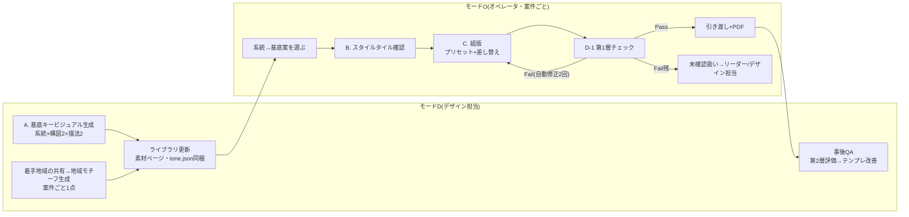
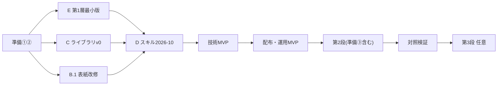

# パンフレット生成パイプライン改善計画書

Sep 24, 2026 · @Hiro

v5(2026-09-26)。v4.1(独立評価者3ラウンド、**4.50/5 合格**)の内容を、Hiroのコメントに沿って再構成した。**第I部「目指すもの」**=改修後のパンフレット作成がモードO(オペレータ)・モードD(デザイン担当)でどう回るかと、完成形の仕様。**第II部「そのために行うこと」**=テンプレ・ライブラリ・スキル・検査・評価者の改修内容と実装方法、段取り。所要時間の見積もりは書かず、順序と依存だけを示す。

## 関係者向け要約(1分で読む)

- 今のスキルは「壊れないが平凡」。原因は、毎回同じ骨格・キービジュアル不在・1色の濃淡・装飾ルールが発動しない・検証が崩れの有無だけ、の5つ
- 直し方は3つ。**表紙の絵(キービジュアル)はデザイン担当が先に作って置いておき、オペレータは選ぶだけ**。**表紙だけ構図を選べるようにする**。**印刷と読みやすさの検査はコードで自動化し、見た目の良し悪しは別の評価者に採点させる**
- オペレータの操作は今とほぼ同じ(番号で選ぶ・「はい」・書き出し)。新しく増えるのは「次に着手する地域をSlackなどで共有する」ことだけで、地域の絵はデザイン担当が用意する
- 配布は段階的に行う(第1段の改修→技術MVP→配布→第2段)。\`pipeline: off\`でいつでも旧手順に戻せる

## 0. 前提と用語

- **モードD(デザイン担当)**: ライブラリ・地域モチーフ・事後QAを受け持つデザイン担当が Claude Code + Figma MCP + Gemini API で実行。フル自動、サブエージェント可、シェル可。次に着手する地域の連絡や困りごとの報告は共有チャンネル(Slackなど)で行う
- **モードO**: コールセンターのオペレータ(最大9名、Figma・Claude初見、シフト制)が Claude web + Figmaコネクタで実行。シェルなし、外部POST不可、サブエージェントなし
- **面(フェイス)**: シートはA3(作業寸法1691×2392px = 297×420mm)。横半分に折ってから巻き三つ折りにするので、片面は3列×2段の6面(各563.7×1196px = 99×210mm、DLサイズ)。折り線は縦2本(x=563.7 / 1127.3)と横1本(y=1196)。表紙面(表1)は表紙フレームの右上の1面(左辺と下辺が折り線、上辺と右辺が仕上がり端)。あいとま/那智勝浦/登別系は下段を180°回転(逆さ面)で組み、MITT系は下段正立。系統ごとの面配置・回転は準備作業①の面表(リポジトリ docs/prep/face-table.md)に従う
- **編集区分(固定・選択・可変)**: テンプレの各要素を「スキルがどこまで変えてよいか」で3つに分けた区分。**固定**=絶対に変えない(寸法・折り・塗り足し・本文の書体/サイズ/行間・固定ブロック)。**選択**=デザイン担当が用意したプリセットから選ぶだけ(表紙の構図K1〜K3と、その中の4パラメータ)。**可変**=tone.jsonに従って毎回必ず変える(色・見出し書体・装飾・イラスト)。使う場所: テンプレ改修で要素ごとの区分を決め(第II部 B)、スキルのStep 3は選択・可変だけを触り(D.2)、第1層チェックは固定が崩れていないことを検査し(6.5)、評価者は固定要素への修正要求を引き渡しリストに回す(6.5)。検査の「第1層/第2層」とは別物
- **構図プリセット K1/K2/K3**: 表紙(表1)の構図の型。K1=全面ビジュアル+無地の文字帯、K2=上にビジュアル(55〜60%、裁ち落とし)+下に情報、K3=タイトル主役+人物1体+余白多め。初版はK2のみ。**見出しプリセット H1/H2/H3**: 表紙見出しの型。H1=太丸ゴシック横組み2色、H2=角ゴシック極太縦組み+左に人物、H3=手書き風横組み+傍点。初版はH1のみ(6.3)
- **px換算**: 係数 `k = フレームの短辺px ÷ シートの短辺mm` \[px/mm\]。冊子フレーム(A3)では k = 1691/297 ≈ 5.69、1pt≈2.01px、3mm≈17px、8mm≈46px、12pt≈24px。乗降スポット表(794×1123 = A4)は k≈3.78。しきい値は必ずkから算出する
- **段(第1段/第2段/第3段)**: 実装の順序(第II部 G)。所要時間は書かない
- **準備作業①②③**: ①Figma側の実測・整備 ②現行フローの実測(印刷会社の要件は決定後に確認) ③評価者の較正セット(第II部 A)
- **対照検証**: 現行版と新版を並べてS1・S2を測る検証(第II部 G)
- **パス1/パス2**: 第2層評価者の2段階採点(パス1=盲検でR1〜R4、パス2=tone.json開示でR5と修正指示)
- **`#`命名(統一一覧)**: 差し替え対象 `#見出し` `#本文` `#注記` `#電話` `#CTA` `#QR` `#バッジ` `#AI表記` / イラスト `#キービジュアル` `#人物` `#車両` `#地域モチーフ` / 装飾 `#帯` `#背景` / 管理 `#tone` `#state` `#config`(非表示) / 素材ページ `#案_透かし有`

# 第I部 目指すもの — 改修後の作成フローと完成形の仕様

## 1. 目的と成功基準

figma-pamphletの叩き台を「修正前提の下書き」から「初見で『おっ』と言わせる完成度70%の初稿」に引き上げる。驚きの源泉は(a)キービジュアルの面積と裁ち落とし、(b)タイトルの大きさと位置、(c)余白配分、(d)大面積の色面であり、書体・装飾・小イラストは補助。この4点を表1面の構図プリセットとキービジュアルで動かし、本文・寸法・折り位置は一切触らない。

| # | 基準 | 目標値 | 測り方 |
| --- | --- | --- | --- |
| S1 | 独立LLM評価者のルーブリック加重平均 | 4.0以上、R2≥4、R3≥3 | モードD: 案件ごと(納品前)。モードO: 事後QAで採点(納品前には測らない)。**現行版比+0.8以上**は対照検証と四半期検証でのみ判定(現行版との対照物が要るため)。対照検証・四半期は同一評価者・同一較正で各案件3回採点し中央値を採用(現行版・新版とも)。3回のレンジが1.0を超える項目はルーブリック文言を見直してから再測 |
| S2a | 発注者選好(Cicacメンバー5名以上×案件3件=15判定以上) | 新版が判定の80%以上(5名×3件なら12/15、p≈0.018)、**かつ評価者の80%以上が3件中2件以上で新版を選ぶ**(判定は同一人物内で相関するため人単位の基準を併記) | ブラインド、左右入替、質問は「配布するならどちらか」 |
| S2b | 読者適合(65歳以上3〜5名) | 5秒提示後の「何をしてほしいか」正答率: 新版≧旧版、**かつ**電話番号を指すまでの所要秒数: 新版≦旧版。どちらか一方でも旧版が勝てば不合格 | サービス地域住民または職員の親族。旧版が勝つ要素は驚きより優先 |
| S3 | 第1層(印刷・可読性)の残存Fail | **入稿時点で**0件(Manualは引き渡しリストへ) | 両モードで自動・毎回。残Failがあるうちは入稿しない(4章) |
| S4 | 1案件の所要(モードO) | 現行実測+20分以内、かつ画面外操作(保存・D&D・別タブ)は現行実測値以内(想定2回) | 準備作業②で現行3案件を実測して分母を確定 |

## 2. 現状と課題

現行スキル(2026-08-20版)は「壊れない叩き台」を達成している。驚きに欠ける原因5つと、解き方:

| # | 原因 | 現行の該当ルール | 解き方 |
| --- | --- | --- | --- |
| C1 | 骨格が毎回同じ | Step 2「テンプレートを複製してから編集」 | 表1面のみ構図プリセット(編集区分「選択」)を開放。初版はK2(裁ち落としヒーロー枠付き)、第2段でK1・K3を追加。中面は「可変」(色など)のみ。K1〜K3は表紙の構図の型(K1 全面ビジュアル / K2 上にビジュアル+下に情報 / K3 タイトル主役。0章・6.3) |
| C2 | キービジュアルが無い | 利用者持ち込み素材を全点使う | デザイン担当が生成する2層ライブラリ(基底+地域レイヤー)。持ち込みは写真(実車・実風景)に限定 |
| C3 | 色が1色相の濃淡のみ | 「メイン1色相の濃淡モデル」 | palette を役割分離(ground/main/main\_tint/ink/cta/accent\_decor)。ctaは電話・CTA専用 |
| C4 | 表現ルールが発動しない | 「フォント・サイズ・レイアウトは変えない」が優先 | 編集区分で解消: 「固定」は変えず、「可変」はtone.jsonで必ず発動。装飾はテンプレの空プレースホルダ差し替え |
| C5 | 検証が「崩れの有無」だけ | Step 4 目視確認 | 第1層(コード)+第2層(独立評価者)。オペレータには○/✗要約のみ |

## 3. 完成形の全体像

原則: 驚きは画像モデルに、正確さは組版に、判定はコードと独立評価者に分担。**生成と評価はデザイン担当(モードD)に寄せ、オペレータ(モードO)は「選ぶ・確認する」だけにする。** 作成フローの詳細は4章(モードO)・5章(モードD)、完成形の仕様は6章。



| フェーズ | モードO(本線) | モードD |
| --- | --- | --- |
| A. キービジュアル | 系統を選び、その基底案(初版2点、以後4点)のスクショから番号で選ぶ(現行の色見本選択と同じ操作)。地域モチーフは共有を受けたデザイン担当が生成済み | Gemini API(有料枠)で基底案(系統×2軸×2水準)と地域モチーフを生成、4Kマスター再生成、切り出し、upload\_assets |
| B. トーン確定 | 同梱tone.jsonをスタイルタイル1枚で確認(「はい」のみ) | 画像からtone.json抽出→正規化→保存 |
| C. 組版 | 構図プリセット(初版はK2固定)→色→見出し→文言→素材。装飾はプレースホルダ差し替え | 同じ+I1切り出し+I2ベクター(第3段) |
| D-1 第1層 | 検査者=コード(preflight.js)が自動実行、人は見ない。水準=印刷・可読性の機械基準(6.5のP1〜P25: 寸法・本文12pt以上・文字あふれ0・コントラスト7:1/4.5:1・塗り足し3mm・折り安全域8mmなど)をPass/Fail/Manualで判定。オペレータには○/✗要約のみ。Failは自動修正2回。残Fail・Manualは引き渡しリストへでリーダーが確認(S3は入稿時点で判定) | 同じ検査を自動で(修正は最大3回) |
| D-2 第2層 | **納品前には実行しない**。デザイン担当が事後QAとして、別のLLM評価者(Claude Project「パンフ評価者」)に採点させる。水準は右と同じ | 検査者=執筆側と独立したLLM評価者(サブエージェント)。水準=ルーブリック(G0欠陥ゲート、R1親しみ・R2行動の明快さ・R3固有性・R4クラフト・R5統一感を各1〜5点。合格はR2≥4・R3≥3・加重平均≥4.0。プロ制作=5点/失敗例=1〜2点の較正セットで較正済み)。最大3周 |
| 引き渡し | 従来Step 5 + 残指摘 + ラッパー書き出し | 同じ |

成果物はすべてFigmaファイル内に残す: 案とライブラリは`素材`ページ、tone.json/状態は制作物フレーム直下の非表示テキストノード`#tone`/`#state`、生成物台帳は案件グループのテキストノード。入稿用のラッパーは`書き出し`ページ、入稿済みは`入稿済み`ページ。

## 4. 作成フロー: モードO(オペレータ、1案件)

目標: 所要は現行+20分以内。画面外操作は「写真素材のD&D(あれば)」と「Export」の2回のみ。オペレータは番号で選ぶ・「はい」・書き出しだけを行う。

1. **依頼文を貼る**: 依頼文テンプレ(案件情報・作るもの・載せる内容・写真素材・色指定・イメージの希望・地域名と名所候補)を貼る。スキルが素材ページの案件グループに`#地域モチーフ`があるかを確認し、無ければ着手せず「準備後に再開」と案内(ゲート。自己申告欄は無い)
2. **系統を選ぶ**: 表紙4系統のスクショから(事業者のブランド指定があればMITT系)
3. **基底案を選ぶ**: その系統の基底案スクショ(番号付き、注記「雰囲気の見本です。文字と細かい配置は変わります」)から番号で選ぶ。消去法(まず一番合わないものを外す→残りから選ぶ)。観点3つ: 「この絵の中にうちの地域の利用者がいると感じるか」「70代の親に渡して『いいね』と言われそうか」「うちの地域の地形と暮らし(山あい/海辺/町なか、農作業/買い物/通院)に近いか」(基底案は名所を含まないため、"町らしさ"は地形と生活場面で判断)。理由を一言(`#tone`の`meta.operator_choice.reason_verbatim`に記録)。「どれも違う」の場合は最も近い基底案で続行して共有チャンネルに報告(他地域のモチーフは使わない)
4. **スタイルタイルに「はい」**: パレットチップ・実タイトルを見出し書体で実寸組み・signature要素・キービジュアル縮小を1フレームにまとめたスクショを見て確認(確認文で`provenance: default`の項目を明示)
5. **自動組版**: Claudeがテンプレ複製→色→見出し→文言→素材(基底+地域モチーフ)→装飾(プレースホルダ差し替え)を実行。写真素材があればここでD&D
6. **第1層の○/✗要約を読む**: スコア・「不合格」の語は出さない。✗は自動修正2回まで
7. **完了報告・残指摘リスト**: **✗が残る場合はPDFファイル名末尾に`_未確認`を付け、入稿しない**
8. **Export**: Figmaで`書き出し`ページの当該案件ラッパー(表紙面・中面)を選択→Export(PDF, High)→印刷会社指定のファイル構成で保存
9. 第2層(評価者)は納品前には動かない。デザイン担当の事後QAで採点される(5.1)

**残✗の解消と入稿判断**: 文字編集・移動で直せるものはCicac側リーダーが直し、それ以外はデザイン担当に回す。入稿は、リーダーが第1層を再実行して✗0を確認してから行う(S3は入稿時点で判定)。

**エスカレーション**: 一次窓口=Cicac側リーダー1名(Figmaの選択・移動・文字編集・Export・第1層の再実行(「チェックをやり直して」と依頼するだけ)の30分研修)。オペレータ向け「困ったときの1枚カード」: ①案が合わない→最も近い基底案で続行し共有チャンネルに報告 ②✗が残る→`_未確認`で終了し、リーダーへ ③Figmaコネクタが切れた→Claude設定で再接続、直らなければ翌日 ④「スキルが古い版」表示→リーダーへ ⑤会話が長すぎる/上限→新しいチャットで「続きから」(`#state`から復元) ⑥「地域モチーフの準備待ち」と言われた→共有チャンネルでデザイン担当に依頼し、用意されたら再開。困りごとは共有チャンネルに1行報告し、デザイン担当が確認。

**オペレータに見せない工程**: tone.json、第1層の中身、評価スコア、ラッパー・rescale、版照合、AI表記の自動挿入。

## 5. 作成フロー: モードD(デザイン担当)

### 5.1 ライブラリ運用(地域モチーフ・基底案・事後QA)

1. **着手地域の確認**: 共有チャンネル(Slackなど)で次に着手する地域(案件名・地域・名所候補)を受け取る
2. **地域モチーフ生成**: 案件ごとに`#地域モチーフ`1点(実在の山・川・名所のシルエット/簡略画、不透明)を生成し、素材ページの案件グループに置く
3. **基底案の生成**(必要な系統のみ): 因子設計=軸1 構図(全面ビジュアル=K1向け / 上ビジュアル+下情報=K2向け)×軸2 描法(手描きの温かみ / フラットで明快)。初版はK2向け1構図×描法2=各系統2点。**背景と前景を分けて生成する**(背景=空・稜線・道・汎用の街並みで人物・車両・名所を描かない / 前景=人物・車両を単色背景で)。プロンプト構造:
   1. 役割: 地域交通の高齢者向けパンフレットを手がけるアートディレクター
   2. 案件(地域モチーフ生成時のみ地域名を渡す。基底案では渡さない): サービスの性格・読み手(70代中心と家族)・ゴール行動(LINE登録、電話は補助)
   3. 必須要素: 背景側=汎用の里山または街並み、空、道(**人物・車両・地域固有の名所は描かない**)。前景側(別生成・切り出し)=顔のある人物1体以上(読み手と同属性、電話をかける/乗車する姿、記号化しない)、乗合タクシー(白いワゴン、**右ハンドル・左側通行**)、受話器またはLINEのアイコン
   4. 因子: 構図・描法(上記)
   5. 制約: **画像比率はプリセットのヒーロー枠に従う**(K1向け=表紙面1面+裁ち落とし(上・右)、例 102:213≈0.48:1(縦長) / K2向け=ヒーロー枠+裁ち落とし、例 102:125≈0.82:1(やや縦長)。レイアウトマスクも同じ枠で描き、K2向けでは文字ゾーンを枠外の下情報域に置く)、タイトル帯の位置は無地(K1向けのみ)、文字を描かない、写実禁止、3Dレンダ調禁止、メーカーロゴ・看板・偽QR・電話番号らしき数字を描かない、着物・杖・白髪だけの高齢者記号化禁止、富士山+桜+鳥居の混合禁止、紫→青グラデ禁止
   6. 参照(自社権利物のみ): **レイアウトマスク**(面の外形・裁ち落とし域・文字ゾーン・CTAゾーンだけを白/灰の矩形で描いた幾何図形)、系統の色チップ、実車両写真。**テンプレ・完成見本・参照ページのスクショや、その一部を切り出したものは、マスク済みであっても渡さない**(出所未記録のイラストを含むため)
   7. 出力: 2K、PNG
4. **採用後**: 同方向で4K・文字なしのマスターを1枚再生成(長辺≤4096px。Figmaは4096px超の画像を自動縮小する)。切り出し素材(人物・車両・地域モチーフ)は単色背景で生成→キー抜き+エッジ収縮で実alphaのPNG化(Gemini系は真のalphaを出さない)。キー色は#00FF00、illustration\_paletteに近い色相があれば#FF00FFに切替。全面ビジュアル(K1/K2ヒーロー)は情景のまま使うのでキー抜きしない
5. **投入**: 出力→curl→`upload_assets(count=N, currentPageId=素材ページ)`→POST→use\_figmaでライブラリグループへ移動・番号ラベル・`#tone`同梱。Claude webではupload\_assetsのURLにPOSTできないため、この工程はモードD限定
6. **トーンの言語化**(採用した基底案ごと): (1)採用画像+ブリーフを渡し「画像に見えるものだけ記述、見えないものは`provenance: default`で既定値表から埋める」でtone.json初稿 (2)6.2の正規化規則を適用 (3)スタイルタイルをスクショで確認 (4)制作物フレーム直下の非表示・ロック済みTEXTノード`#tone`(フォントはNoto Sans JP Regular固定)として保存し、素材ページの案件グループにも複製
7. **事後QA**: 納品済みの制作物をClaude Project「パンフ評価者」で第2層採点。指摘はテンプレ・変換表・ライブラリの改善に反映
8. **締め**: 共有チャンネルの報告・`_未確認`案件の確認→`#config`更新(版・pipelineフラグ)。入稿済みのラッパーを`入稿済み`ページへ移す

### 5.2 案件をモードDでフル実行するとき(技術検証・難案件)

A 生成(5.1の3〜5)→B 言語化(5.1の6)→C 組版(4章と同じ手順を自動で)→D-1 第1層(Failは自動修正、最大3回)→D-2 第2層(サブエージェント評価者)→修正→…最大3周→引き渡し+PDF。ループ制御:

1. 各周の開始時にフレームを複製し`案件_表紙_r1/_r2/_r3`とする(Figma状態を上書きしない)
2. 組版→第1層→スクショ→第2層→上位3件修正→第1層から
3. 最大3周。採用は**最終周**を既定とし、前周比で加重平均が0.3以上下がった場合のみ前周に戻す
4. 早期停止: ピンポン(同一項目が交互に上位3に出る)/固定層要求(上位3がすべて不可変ノード)/平坦化(Δ<0.2かつ1点以上改善した項目なし)/装飾インフレ(装飾ノード数が周ごとに増える)/決定的退行(第1層Fail数が減らない)
5. 状態(周・スコア・解決済みリスト)は`#state`に保存し、次周の評価者に解決済みリストを渡す

### 5.3 切り替え・配布・ロールバック

- 新テンプレ系統・テンプレ改修・スキル版上げは必ずモードDで検証してから配布
- 配布はClaude Team組織スキルで一括(デザイン担当がアップロードする)。旧zipは専用ページ`入稿済み`(管理用)に日付付きで保管
- `#config`の`pipeline: off`で全員を2026-08-20手順へ即時ロールバック可能

## 6. 完成形の仕様

### 6.1 キービジュアル・ライブラリ(2層)

| 層 | 単位 | 内容 | 生成タイミング |
| --- | --- | --- | --- |
| (i) 基底キービジュアル | テンプレ系統 | 系統(あいとま/那智勝浦/登別/MITT)×構図2×描法2=各系統4点。**背景と前景を分けて持つ**。背景=空・稜線・道・汎用の街並み(人物・車両を描かない)、前景=人物・車両の切り出し。**地域モチーフを含まない**。地平線帯(上端から約60%)は単純な稜線にとどめ、後から`#地域モチーフ`で覆える余地を残す。色帯域は系統のパレットに従う(那智勝浦系は寒色可、MITT系はブランド色固定) | 初版はK2向け1構図×描法2=各系統2点、計8点。第2段でK1向けを足して各系統4点。以後は随時差し替え |
| (ii) 地域レイヤー | 案件 | `#地域モチーフ`1点(実在の山・川・名所のシルエット/簡略画、不透明)。あれば実風景写真(I3) | **次に着手する地域(案件名・地域・名所候補)をSlackなどの共有チャンネルで共有** → デザイン担当が生成(5.1) |

スキルは依頼文の申告に頼らず、素材ページの案件グループに`#地域モチーフ`が存在するかをuse\_figmaで確認し、無ければ着手しない。他地域のモチーフを含む画像は使わない。

**ヒーローの層構造(表1、背面→前面)**: `#キービジュアル`=背景(CROP) → `#地域モチーフ`=背景の直上、地平線帯(`hero_horizon`、基底案の汎用山並みを覆う不透明シルエット) → `#人物` `#車両`=最前面(FIT)。人物・車両は別レイヤーなので、シルエットが顔や車両を隠すことはない。`info_badge`(下情報域の`#バッジ`隣、高さ≤面の12%)はK3(タイトル主役で地平線が無い構図)向けで第2段。シルエットはR5の描法照合の対象外。

### 6.2 tone.json v3(トーンの言語化の器)

**現行スキルには無い新規の仕組み。** 採用した基底案の「見た目の方針」を、形容詞ではなく機械が読める値(色はhex、寸法はmm、書体名、enum、比率)で書いた1枚のデータ=デザイン指示書のデータ版。デザイン担当が基底案ごとに1回書いてライブラリに同梱する(オペレータはスタイルタイルで「はい」と言うだけ)。読む側は4つ: (1)スキルのStep 3がこの値どおりにFigmaを操作する(D.2の変換表) (2)同じ画風で追加素材を生成するときのブリーフ (3)第1層チェックがしきい値として読む (4)評価者がパス2でR5(統一感)の照合に使う。各ブロックをどの読み手が使うかを `consumers` で明示し、誰も読まない項目は持たない。保存先は制作物フレーム直下の非表示テキストノード `#tone`。`confidence` は `provenance`(image / brief / operator / rule / default)に置き換えた。

```json
{
  "schema_version": "tone/3",
  "meta": {
    "template_family": "あいとま系",
    "sheet": {"size_mm": [297, 420], "fold": "half_then_roll3", "px_per_mm": 5.69},
    "faces": {"cover": {"name":"表1","size_mm":[99,210],"position":"top_right","rotated_in_frame":false},
              "back": {"name":"表4","size_mm":[99,210],"rotated_in_frame":true}},
    "fold_lines_px": {"x": [563.7, 1127.3], "y": [1196]}, "bottom_row_rotated": true,
    "locked": {"brand_palette": false, "body_typography": true, "fold_and_bleed": true,
               "fixed_blocks": ["発行者情報","電話ブロック","QR"]},
    "library": {"base_id": "aitoma-K2-hand-01", "regional_motif_id": "kurabuchi-haruna-01"},
    "operator_choice": {"selected_option": 2, "reason_verbatim": "うちの地域の人っぽい"}
  },
  "direction": {"label":"あたたかい手描き","one_liner":"クリーム地に朱色の帯、丸ゴシックの大見出し、人物と実車を主役に",
                "mood_words":["あたたかい","ご近所","手を差し伸べる"]},
  "composition": {
    "cover_preset": "K2_top_visual",
    "hero": {"area_ratio_of_face": 0.55, "bleed_sides": ["top","right"], "crop_focus": "person_and_vehicle"},
    "title": {"placement": "bottom_left", "align": "left", "scale": 1.0, "max_width_ratio": 0.7},
    "cta_block": {"placement": "bottom_right", "panel": "solid"},
    "margin_scale": "normal"
  },
  "palette": {
    "roles": {"ground":"#FBF3E6","main":"#B8441B","main_tint":"#F6D6C8","panel":"#FFFFFF","ink":"#231815",
              "cta":"#A50021","cta_text":"#FFFFFF","accent_decor":"#2E7D5B"},
    "cta_slots": ["#電話","#CTA"], "accent_decor_slots": ["#バッジ"],
    "illustration_palette": ["#B8441B","#F6D6C8","#2E7D5B","#F2C9A0","#231815"],
    "print": {"max_saturation_large_fill": 0.80, "min_tint_pct": 5, "gradients_allowed": false}
  },
  "typography": {
    "headline_preset": "H1_round_black_horizontal_2tone",
    "headline": {"family":"Zen Maru Gothic","weight":"Black","line_height":1.25,"tracking_pct":-2,
                 "treatment":"solid_on_panel",
                 "two_tone":{"enabled":true,"colors":["#231815","#B8441B"],"apply_to":"service_name"},
                 "effects":{"outline":{"enabled":false,"max_ratio_of_size":0.06},"shadow":{"enabled":false}}},
    "numerals": {"family":"Noto Sans JP","weight":"Black","phone_min_ratio_to_body":3.0,"tilt":"none"},
    "body": {"locked_by_template": true, "allowed_families": ["Noto Sans JP","BIZ UDPGothic"], "min_pt": 12}
  },
  "decoration": {
    "signature_element": "tilted_band",
    "signature_params": {"rotation_deg": -4, "max_chars": 8, "text_rotates_with_band": true},
    "budget": {"max_devices_per_face": 3, "max_shape_patterns": 3},
    "corner_radius_mm": {"small": 2, "large": 6}, "shadow_policy": "none",
    "background": {"type": "flat", "gradient": null},
    "no_go_zones": ["fold_8mm","trim_3mm","body_text_boxes","phone_and_qr"]
  },
  "illustration": {
    "source_policy": "single_source", "source": "library_nbp_master_4k",
    "style": {"rendering":"flat_vector_thick_outline","outline_mm":0.6,"shading":"none","background":"transparent"},
    "subjects": [
      {"id":"hero_person","desc":"70代女性、受話器を持って穏やかに笑う","facing":"toward_cta","placeholder":"#人物"},
      {"id":"vehicle","desc":"白いワゴン型乗合タクシー、右ハンドル","placeholder":"#車両"},
      {"id":"local_motif","desc":"(地域レイヤー) 榛名山のシルエット","placeholder":"#地域モチーフ","placement":"hero_horizon"}],
    "min_effective_dpi": 200,
    "photos": {"allowed": true, "use": "実車・実風景のみ。中面の信頼ブロック限定。イラストと同一面に混ぜない"}
  },
  "avoid": {
    "generation": ["3d_pixar_render","glossy_skin","left_hand_drive","kimono_elderly","cane_white_hair_only",
                   "fuji_sakura_torii_mix","fake_logos_qr_digits","english_heavy","photo_realism","purple_blue_gradient"],
    "layout": ["multiple_text_effects_on_one_text","tilted_body_or_numbers","text_over_image_without_panel",
               "rainbow_or_diagonal_gradient_bg","more_than_2_font_families","exclamation_star_overuse",
               "box_everything","reversed_white_small_text"]
  },
  "provenance": {"composition.cover_preset":"default","palette.roles.main":"image","palette.roles.cta":"rule",
                 "typography.headline.family":"default","decoration.signature_element":"image"},
  "consumers": {
    "figma_conversion": ["composition","palette.roles","typography.headline","typography.numerals","decoration","illustration.subjects"],
    "illustration_brief": ["illustration","palette.illustration_palette","avoid.generation","direction.mood_words"],
    "preflight": ["meta.sheet","meta.fold_lines_px","palette.print","typography.body","typography.headline.effects","decoration.budget","decoration.no_go_zones","illustration.min_effective_dpi","avoid.layout"],
    "evaluator_pass2_R5": ["direction","palette.roles","typography.headline","illustration.style","provenance"]
  }
}
```

**編集区分「選択」のパラメータ**: `composition.title.scale`(0.8〜1.2、プリセットの基準サイズに対する倍率。サイズ範囲はプリセット側が持つ)、`composition.title.align`(left/center)、`composition.hero.crop_focus`(切り抜き位置)、`composition.margin_scale`(normal/wide)。この4つだけが「選択」で、他の幾何は変えない。

**正規化規則**(5.1の6で適用):

- `main/main_tint`は既存の濃淡2群置換へ。`main`は白文字を載せるなら白と≥4.5:1、文字色として使う(two\_tone)ならpanelとgroundの両方に≥4.5:1まで暗くする(例 #D9542B(4.0:1)→#C24A1E(ground上4.44:1で未達)→#B8441B(ground上4.9:1、白上5.4:1))
- **`cta`はground・白の両方に対し7:1以上まで暗くする(例 #A50021=7.3:1)**。これで変換表の「7:1未満なら数字はink」は例外にしか発動しない
- `ground`は淡色地の網点下限(5%)以上
- `locked.brand_palette=true`(MITT系)はmain/main\_tintをテンプレ値で上書き
- `headline.family`はフォント許可リスト(6.3)へマッピング。`signature_element`は1つ
- 保存先は`#tone`非表示テキストノードに固定(**FrameNodeにdescriptionは書けない(COMPONENT専用、書き込みはthrow)・setPluginDataはuse\_figmaで禁止**のため)

### 6.3 組版の規則(編集区分・プリセット・装飾・イラスト・フォント)

| 編集区分 | 対象 | スキルの扱い |
| --- | --- | --- |
| 固定 | フレーム寸法・折り位置・塗り足し、本文/注記の書体・サイズ・行間・位置、固定ブロック(発行者情報・電話ブロック・QR)の位置 | 変えない(現行どおり)。第1層チェックが崩れていないことを検査し、評価者からの変更要求は引き渡しリストへ |
| 選択(表1のみ) | 表紙の構図。プリセットK1〜K3から選び、その中で6.2の4パラメータ(title.scale・title.align・hero.crop\_focus・margin\_scale)だけを許す | プリセットはデザイン担当が事前設計し印刷安全域を検証済み。LLMは幾何を発明せず「選ぶ」 |
| 可変 | 色(役割分離)、見出し書体・プリセット、装飾(プレースホルダ差し替え)、イラスト | tone.jsonに従って毎回必ず変える(D.2の変換表) |

**構図プリセット(表1)**: K1 全面ビジュアル+無地の文字帯 / K2 上ビジュアル55〜60%(上・右3mm裁ち落とし。左と下は折り線)+下情報 / K3 タイトル主役+人物1体+余白多め。**見出しプリセット**: H1 太丸ゴ横組み2色 / H2 角ゴ極太縦組み+左人物 / H3 手書き風横組み+傍点。**初版はK2×H1のみ**、K1・K3・H2・H3は第2段で追加。

**装飾はプレースホルダ差し替えで発動する**: テンプレに装飾用の空レイヤーを事前配置し(`#キービジュアル` `#帯` `#背景` `#バッジ` `#地域モチーフ`)、実行時は新規ノード生成をしない。理由: (a)180°回転面での新規追加はfigma-ops.mdが避けるべきとしている、(b)折り位置・塗り足しの侵犯をテンプレ側で構造的に防げる、(c)モードOで失敗の説明が不要になる。初版の装飾は表紙面のみで、**中面は濃淡2群置換(色)のみ**。見出し書体・装飾・地域モチーフは、中面に命名・プレースホルダが入る第2段から。

**装飾の配置規則**(P5/P6/P18で機械判定):

1. **文字は表紙・中面とも折り線(縦2本・横1本)±46px(8mm)に置かない**(P6)
2. 装飾は、表紙フレームでは面ごとに完結させ折り線±17pxに置かない。中面では背景・イラストの折り軸またぎを許す
3. 折り線±17pxに相対輝度0.2未満のベタを置かない(背割れ、P18)
4. 装飾の辺は「仕上がり端から≥17px内側」か「≥17px外側まで延長」のどちらか(端ピタ禁止、P5)
5. 帯内テキストは帯と一緒に回転(グループ化)、文字数≤8。本文・電話番号・QR説明は絶対に傾けない
6. 背景は既定フラット。グラデはtone.jsonで明示された場合のみ、階調差15%以上・長さは面の30%以内
7. 1テキストに効果(フチ・影・グラデ)は1種まで。1面の装飾は3種まで

**イラスト投入経路**:

| 経路 | モード | 生成 | 投入 | 用途 |
| --- | --- | --- | --- | --- |
| I0 ライブラリ(基底+地域) | O/D | デザイン担当が生成(5.1) | 素材ページからclone(既存の手段A) | キービジュアル・人物・車両・地域モチーフ(本線) |
| I1 案件固有の切り出し | D | 4Kマスター→キー抜き | curl→upload\_assets(PNG, scaleMode FIT) | ライブラリ外の希望がある案件 |
| I2 ベクター(Recraft V4 Styles Vector) | D(第3段) | I1をスタイル参照にSVG生成 | upload\_assets(SVG)→FRAMEの子へ移動 | ワンポイント・アイコン群 |
| I3 持ち込み | O/D | 利用者 | 従来どおり | **写真(実車・実風景)に限定**。中面の信頼ブロック。イラストと同一面に混ぜない |

**1紙面1ソース原則**: イラストは同一経路のものだけを使う。持ち込みイラストがある場合は「写真に差し替える」か「ライブラリを使わず持ち込みだけで作る(現行方式)」のどちらかを確認する。

**フォント許可リスト**:

- 許可: Noto Sans JP / BIZ UDPGothic / BIZ UDGothic / Zen Maru Gothic / Zen Kaku Gothic New / M PLUS Rounded 1c / M PLUS 1p(いずれもGoogle Fonts・OFL・Figma標準搭載・PDF書き出しでglyph化)
- **本文・注記・固有名詞(地名・サービス名・電話番号)はNoto Sans JPまたはBIZ UDPGothicのみ**(JIS第2水準・UD)。装飾書体は`#見出し`系に限定
- フォールバック: 見出し=Noto Sans JP Black、本文=BIZ UDPGothic
- テンプレート・参照ページを含む全TEXTの非Google Fontsは0(準備作業①で確認)。見出し書体変更後はget\_screenshotで欠字・混植を目視(P8-b)

### 6.4 入稿PDF(3つの寸法)

FigmaのPDF書き出しは1px=1pt・1xのみ。1691×2392pxをそのまま書き出すと596.5×843.8mm・塗り足しゼロになる。

| 層 | 寸法 | 役割 |
| --- | --- | --- |
| 作業寸法 | 1691×2392px = A3 297×420mm(横型は2392×1691) | テンプレ・参照と同一。resize禁止は維持 |
| 書き出しラッパー(rescale前) | 1725.2×2426.2px(四辺+17.08px=3mm) | `書き出し`ページの空フレーム(clipsContent=true、fill=ground)に制作物フレームのクローン(clipsContent=false)を(17.08, 17.08)に入れる |
| 書き出しラッパー(rescale後) | 858.9×1207.9px = 303×426mm @1px=1pt | ラッパーに `rescale(0.497865)`(=841.89/1691。A3の短辺pt÷作業px)。子のクローンも同率で縮み、位置は(8.5, 8.5) |
| 入稿寸法 | 303×426mm(トンボなし) | rescale後のラッパーをPDF(画質High)で書き出し |

- 案件ごとに表紙面ラッパー・中面ラッパーの2枚(命名`案件名_表紙_書き出し_日付` / `案件名_中面_書き出し_日付`)。印刷会社の指定に従って「表面/裏面の2ファイル」または「2ページPDF」(既定は2ファイル)。ラッパー作成・rescaleはスキルが自動で行い、Export操作(PDF, High)だけを人が行う
- 既定はsRGBのままPDF→RGB入稿可の印刷会社(ラクスル等)へ。PDF/X-1a・CMYK必須の会社のみ Acrobat Pro/Illustratorで変換(Japan Color 2001 Coated)。TinyImageでのCMYK変換は使わない(プロファイル不明・DPI順序依存)
- **黒の扱い**: 12pt未満の文字セグメント(`#注記`を含む)は#000000に統一(P25でセグメント単位に判定)。RGB入稿ではRGB黒がK100に置換されるかを印刷会社の決定後に確認。X-1a変換時は#000000/#231815→K100へ置換。広い黒ベタは使わない
- 制作物フレームはclipsContent=false(塗り足し要素をフレーム外へ延ばす)。トンボはデータ内に描かない

### 6.5 二層ハーネス(自己検証)

**第1層: 決定的チェック(preflight.js、use\_figmaで実行)**。対象フレームを走査し、Pass/Fail/**Manual**(要目視)の3値と該当ノードID・実測値・修正案をJSONで返す。オペレータには○/✗要約だけを見せる。しきい値は係数kから算出。

| ID | チェック | しきい値(高齢者向け、k≈5.69) | 判定 |
| --- | --- | --- | --- |
| P1 | 3つの寸法 | 作業1691×2392(±0) / ラッパーrescale前1725.2×2426.2(±0.5px)・rescale後858.9×1207.9(±0.2px) / PDF実寸303×426mm | ラッパー生成直後とExport直前の2回走らせる。PDF実寸は人手(モードD: pdfinfo) |
| P2 | 本文サイズ | `#本文`≥12pt(24px)、`#注記`≥10pt(20px)、全TEXT絶対下限6pt(12px)、白抜き≥12pt(24px。P25・avoid.layoutの`reversed_white_small_text`と整合) | セグメント走査 |
| P3-a | 文字あふれ | 0件 | `textAutoResize==='NONE'`のTEXTのみ。全フォントロード→clone→`'HEIGHT'`→高さ比較→remove |
| P3-b | はみ出し | 0件 | absoluteBoundingBoxが所属面・clipsContent祖先内か |
| P4 | コントラスト | 本文・`#注記`・`#電話` 7:1、見出し(two\_toneのmain色を含む)4.5:1 | 背景候補=矩形を90%以上覆う可視ノードのうちDFS前順で手前の最上位。two\_toneのmain色はpanel/groundの実背景で判定。SOLID・不透明のみ計算、GRADIENT/IMAGE/半透明はManual。袋文字はstroke色で計算 |
| P5 | 塗り足し・端ピタ禁止 | 辺に接する要素は外側≥17px、非裁ち落とし要素(文字・QR・ロゴ)は内側≥17px。制作物フレームclipsContent=false | absoluteBoundingBoxと仕上がり矩形 |
| P6 | 折り安全域 | 文字が折り線(縦 x=563.7/1127.3、横 y=1196。横型フレームは縦横を入れ替え)から≥46px(表紙・中面とも)。折り線をまたぐ文字はFail | 装飾・背景は対象外 |
| P7 | 仮置き文言 | 0件 | `[〇○◯]{2,}` `0000` `[（(]仮[)）]` `ダミー` `サンプル` `XXX` `TODO` |
| P8 | フォント | family完全一致(6.3)。本文・固有名詞はNoto Sans JP/BIZ UDPGothicのみ | 混植はP8-b人手 |
| P9-a | 印刷再現性 | HSVでS>0.85∧V>0.85∧色相170〜300°はFail。S>0.9∧V>0.95の暖色はFail。淡色地の最大チャンネル1〜4%はWarn | SOLID/GRADIENT stop |
| P9-b | avoid.layout | tone.jsonのavoidに該当するfill・効果 |  |
| P10 | 人物 | `#人物`のimageHashがテンプレ原本と異なる OR 可視の子ノード≥1 | 原本hashは準備作業①で採取 |
| P11 | QR | `#QR`短辺≥114px(2cm)、他ノードとの最小ギャップ≥11px(2mm) | 画像内部の余白は人手 |
| P12 | 電話番号 | `#電話`のfontSize ≥ 本文中央値×3 |  |
| P13 | 画像解像度 | `dpi = 画像px ÷ 配置px × k × 25.4`(冊子では×144.6)。フラット≥200(Fail<150)、写真≥300(Fail<200)、QR≥300またはベクター | `getImageByHash(hash).getSizeAsync()`、scaleMode考慮 |
| P13-b | 切り抜きalpha | `#人物`等のPNGがalpha付き(IHDR color type 4/6)、または背景色=ground | `getBytesAsync()`でヘッダ判定 |
| P14 | 色数 | IMAGEと許可色の濃淡を除いた一意fill ≤4 |  |
| P15 | 効果の重掛け | 1TEXTにstroke/shadow/gradientのうち2つ以上でFail |  |
| P16 | 書体・線幅 | 書体ファミリ≤2。stroke≥1px、白抜き線≥2px |  |
| P17 | 装飾数 | 1面の装飾ノード≤3、角丸半径の種類≤2 |  |
| P18 | 折り線上の濃色ベタ | 折り線±17pxに相対輝度<0.2の塗り→Warn | 背割れ |
| P19 | カラープロファイル | `figma.root.documentColorProfile==='SRGB'` |  |
| P20 | 透明効果の棚卸し | effects/opacity<1/blendMode≠NORMALの一覧(報告のみ) | 人手で200%確認 |
| P21 | 機種依存文字 | `[①-⑳㈱㈲㈹℡㍻㍼髙崎]`等0件 |  |
| P22 | 出所 | 可視透かし付き(`#案_透かし有`)画像が制作物内に0件、生成物台帳ノードあり | 透かし自体の目視は人手 |
| P23 | AI表記 | `#AI表記`に固定文あり | 生成画像を使った場合のみ必須 |
| P24 | 書き出し設定 | PDF High、対象=rescale後ラッパー、ファイル構成(2ファイル/2ページ)が印刷会社指定と一致 | UI設定のため人手 |
| P25 | 黒の扱い | 12pt未満の文字セグメント(`#注記`を含む)のfillが#000000。広い黒ベタ(面積>面の5%かつ輝度<0.05)なし | セグメント単位 |

**第2層: LLM評価者(モードD / 事後QA)**。執筆側の思考・履歴を見ない別の評価者が、面単位・正立のスクショ(表1は長辺1568pxで単独)、事実だけのブリーフ、ルーブリック、較正例、可変ノード一覧(名前+面座標mm+可変属性)を受け取り、(0)採点前に「プロのADなら直す点を3つ」を書く (1)G0欠陥ゲート (2)パス1: R1〜R4を既定3点から出発、4以上には画面上の観察を2つ引用 (3)パス2: tone.jsonと可変ノード一覧を開示しR5と修正指示 (4)チェックリスト該当IDを列挙、の順で採点する。**tone.jsonはパス2まで渡さない**。モードOでは納品前には実行せず、デザイン担当の事後QAで採点する。

| 項目 | 5点 | 3点 | 1点 | 減点トリガー |
| --- | --- | --- | --- | --- |
| G0 欠陥ゲート(合否) | 生成画像に手指/顔/車両(ハンドル位置・ドア数)/画像内文字の破綻がなく、仮置き文言もない | — | — | 1件でも該当で不合格、再生成指示のみ |
| R1 親しみ・温度 | 顔のある人物が表1ビジュアルの1/3以上、地域の暮らしの中でゴール行動をしている。大面積の色が暖かい(寒色系統では「明るく澄んでいる」) | 人物はいるが小さい/汎用的 | 人物なし、白地に箱の羅列、威圧的 | 同一笑顔のAI定型(−1)/着物・杖・白髪の記号(−1)/視線がCTAと逆(−0.5) |
| R2 行動の明快さ(ゲート、4未満は不合格) | 5秒で「電話する/LINE登録する」と言え、電話番号が本文の3倍以上で受付時間付き、QR2cm角以上+説明 | CTAが2つ同格で競合 | CTAが埋もれる | 本文・数字への袋文字・影・傾き(−1)/座布団なしの画像上文字(−1)/1面に3メッセージ以上(−1) |
| R3 固有性・非定型(対比評価) | **同一基底案を使った直近2件**と並べて一目で別物、固有要素(地域モチーフ、実車、愛称、地名入り見出し)が本文以外に3つ以上 | 固有要素1〜2 | 地名を消せばどこでも使える | チェックリスト該当1件ごと(−0.5)/富士山+桜+鳥居(−1) |
| R4 クラフト | 最大要素が1つで2番目との差が明確、余白が3群以内、角丸・罫線・線幅が揃う | 均一サイズで主役不在 | 密集、端が揃わない | 効果2種以上(−1)/角丸不統一(−0.5)/1〜2mmのズレ3箇所以上(−1) |
| R5 統一感(パス2) | すべてのイラストが同一描法、色はtone.jsonの役割どおり、見出し書体は1種 | 描法の違う素材1点 | 描法の混在、面ごとに書体が違う | 持ち込み混在1点ごと(−0.5)/provenance=defaultは照合対象外 |

合格: R2≥4、R3≥3、加重平均(R1 .25/R2 .25/R3 .25/R4 .15/R5 .10)≥4.0。現行版比+0.8以上は対照検証・四半期検証で判定。修正指示は`{"node":"#人物","face":"表1","severity":"must|should","targets":"R1","instruction":"…"}`を最大3件。不可変ノードへの要求は`handoff:true`で引き渡しリストへ。評価者は運用前に較正セットで較正し、ホールドアウトで人間との一致率(±1以内80%以上)を確認する(第II部 F)。

### 6.6 運用の約束(ライセンス・教材)

**ライセンス早見表**:

| 画像ソース | 商用 | 自治体配布物 | 注意 |
| --- | --- | --- | --- |
| Nano Banana Pro(Gemini API/AI Studio 有料枠) | 可(Googleは所有権を主張しない) | 可。内規確認+AI表記推奨(東京都手引き) | 同一・類似出力が他者にも生成され得る/知財補償なし/著作物性が否定され得る(独占不可)/SynthID(不可視) |
| Geminiアプリ(無料・AI Pro) | 可視透かし付き | **不可**(透かし、学習対象) | 案の比較・検討のみ。透かし除去は来歴偽装に当たり得る |
| Recraft V4(有料/API) | 可(全権利ユーザー) | 可(内規確認) | 権利は生成時点で確定。無料プランは不可。初版では不採用 |
| Weave経由 | 価格ページ上は商用可 | **要検証**(Weave ToS本文未確認) | 配布前に規約を保存。初版では不採用 |
| ソコスト / ちょうどいいイラスト / unDraw / Linustock | 可 | 可 | **AI学習・参照入力・AIツールへのアップロード禁止(ソコスト明記、unDraw学習禁止)**。生成AIの参照には絶対に渡さない |
| Google Fonts(OFL) | 可(印刷・埋め込み・アウトライン化) | 可 | 表記不要 |
| テンプレ内の既存イラスト(出所未記録) | 出所次第 | 出所確認まで不可 | 準備作業①で台帳化。AI入力禁止(レイアウトマスクはこれを含まない幾何図形のみ) |

- ヒアリングで「生成AIイラスト使用の可否」を確認し、書面(メール可)で同意を得てから使う
- テンプレの発行者情報欄に固定文`#AI表記`「イラストの一部は画像生成AIで作成し、発行者が内容を確認しています」
- 生成物1点ごとにモデル名・経路・日時・プロンプトを案件グループの台帳ノードに記録
- 実在の人物・ロゴ・キャラクター・メーカーエンブレム・実在店舗の看板に似せる指示は排除。事業者の実車ラッピングは権利者確認のうえ再現可

**教材への影響**: ハンドブックの純増は+1ページ(「系統→基底案を選ぶ」は現行「色を選ぶ」ページの差し替え)+1枚カード。説明会デモは変更スライド1枚。リーダーには第1層の再実行とExportの30分研修。

# 第II部 そのために行うこと — 改修内容と実装方法

第I部の完成形に到達するために、何をどう変えるかを対象別(準備・テンプレ・ライブラリ・スキル・第1層・第2層)に書く。段取りはG、最初の実験はH。所要時間は書かない。

## A. 準備作業(実装前に確定させる事実)

| 準備 | やること | 使い道 |
| --- | --- | --- |
| ① Figma側の実測・整備(第1段冒頭) | 系統ごとの面表(実寸・向き・回転・表4の正立手順)、`listAvailableFontsAsync()`の実出力(許可リスト7書体の全styleを写し、テンプレ・参照ページの非Google Fontsを0に)、テンプレ原本のimageHash採取、レイアウトマスクの作成(デザイン担当が新規に描く幾何図形)、PDF画質設定(High)の場所確認、テンプレ内既存イラストの出所台帳化、専用ページ`入稿済み`の作成 | 面表→P1/P6/正立スクショ、フォント→P8・変換表、hash→P10、マスク→生成参照 |
| ② 現行フローの実測(第1段中に並行) | 現行3案件の所要・画面外操作の実測。印刷会社の入稿要件(縮尺・塗り足し・トンボ・ファイル構成・RGB黒のK100置換)は印刷会社が未定のため準備段階では扱わず、6.4の既定値(2ファイル・sRGB・トンボなし)で進める。印刷会社が決まった時点で既定値を確認し直す | S4の分母。印刷会社の要件は決定後にP24・6.4へ反映 |
| ③ 評価者の較正セット(第2段冒頭) | (a)現行完成見本3枚 (b)他自治体・他事業者のプロ制作パンフ3枚(5点の基準) (c)意図的な失敗例3枚(1〜2点の基準)。デザイン担当とCicac側リーダーが独立に採点し根拠文付きに。別の3枚(ホールドアウト)で評価者と人間の一致率(±1以内80%以上)を確認 | 第2層(F)の運用開始条件 |

## B. テンプレ改修

**B.1 表紙フレーム(4系統、第1段)**: 既存ノードの命名(`#本文` `#注記` `#見出し` `#電話` `#CTA` `#バッジ` `#QR` `#AI表記`)。ヒーロー枠`#キービジュアル`の追加(K2: 表紙面=右上の1面 99×210mm の上55〜60%、上/右3mm裁ち落とし、左と下は折り線、scaleMode CROP)。その上に`#地域モチーフ`(hero\_horizon位置)、最前面に`#人物` `#車両`(FIT)。装飾用の空プレースホルダ`#帯` `#背景`(`info_badge`用は第2段)。12pt未満の文字色を#000000へ。`テンプレート`ページに非表示ノード`#config`(`skill_min_version`、`pipeline: on/off`)。制作物フレームはclipsContent=false。改修後に原本imageHashを採取し直す。プレースホルダの位置は6.3の配置規則(折り線±17px、端ピタ禁止)を満たすように置き、設計時点でP5/P6を通す。

**B.2 中面フレーム(第2段)**: 命名とプレースホルダを中面にも入れ、見出し書体・装飾・地域モチーフを中面でも発動させる(第1段の中面は濃淡2群置換のみ)。

**B.3 プリセットの追加(第2段)**: 構図K1・K3、見出しH2・H3、`info_badge`プレースホルダ。各プリセットは印刷安全域を検証してから導入。

**B.4 中期**: 次回テンプレ改修時に1pt=1px(595.28×841.89+裁ち落とし)へ作り直し、以後のしきい値をpt直値にする。

## C. キービジュアル・ライブラリの構築

ここでの「ライブラリ」は6.1のキービジュアル・ライブラリ。コードのライブラリではなく、Figmaファイルの`素材`ページに置く画像セットで、中身は(1)系統ごとの基底キービジュアル(背景の絵) (2)切り出し済みの人物・車両(前景のPNG) (3)案件ごとの地域モチーフ (4)基底案ごとのtone.json。デザイン担当がNano Banana Proで作って置いておき、オペレータはここから番号で選ぶ。現行スキルの`素材`ページ(利用者の持ち込み素材置き場)を拡張して使う。

- **v0(第1段)**: 基底案 K2向け×描法2×4系統=8点(背景)+切り出し済み人物・車両(前景)+各基底案のtone.json最小版+くらぶちモック用の`#地域モチーフ`1点。手順は5.1の3〜6をそのまま使う
- **第2段**: K1向けを足して各系統4点
- **受け入れ基準**: 基底案は地域モチーフ・文字・ロゴを含まない、地平線帯が単純、画像比率がヒーロー枠と一致、4KマスターがP13の式で≥200dpi、切り出しはP13-bを通る。台帳(モデル名・経路・日時・プロンプト)を同時に書く
- **素材ページの構造**: 系統ごとのライブラリグループ(番号ラベル付き、`#tone`同梱)と、案件ごとの案件グループ(`#地域モチーフ`・台帳ノード)。透かし付きの検討案は`#案_透かし有`で別グループに隔離

## D. スキル改訂(figma-pamphlet 2026-10版)

### D.1 Step別の改訂

| 場所 | 改訂 |
| --- | --- |
| Step 0 | `テンプレート`ページの非表示ノード`#config`(`skill_min_version`, `pipeline: on/off`)と自版を照合。古ければ停止して更新依頼を表示。`pipeline: off`なら2026-08-20手順で動作(遠隔ロールバック) |
| Step 1 ヒアリング | 「生成AIイラスト使用の可否(自治体・事業者の内規)」「地域名・名所候補(リーダー記入)」を追加。着手可否は申告ではなくStep 1.5のゲートで判定。素材の項目は「写真(実車・実風景)があれば」に変更 |
| Step 1.5 | 色見本選択→**系統→基底案を選ぶ**(4章の3)。その前に素材ページの案件グループに`#地域モチーフ`があるかをuse\_figmaで確認し、無ければ着手しない |
| 新Step 1.7 | スタイルタイル確認→`#tone`保存 |
| Step 2 | 系統×構図プリセットを複製。`#state`から再開可能に |
| Step 3 | 変換表(D.2)に従う。装飾はプレースホルダ差し替え。新規ノード生成をしない |
| Step 4 | 第1層(E)を自動実行。○/✗要約のみ表示。Failは自動修正2回、残りは引き渡しへ |
| Step 5 | ラッパー作成・rescale(D.3)・残指摘・生成物台帳の確認・`#AI表記`の存在。残✗があれば「未確認」と明記 |
| 新規 references/keyvisual.md | 5.1の手順、プロンプト、面表、フォントマッピング、ライブラリ運用 |
| 新規 references/preflight.md | 6.5第1層の仕様とスクリプト(逐語・≤25KB) |
| 新規 references/evaluator.md | 第2層のルーブリック・較正セット・Project設定(モードD/事後QA用) |
| template-and-assets.md | 3層定義、装飾の配置規則、入稿PDFの生成、フォント許可リスト、`#`命名規約(0章の統一一覧) |

実装の進め方: Stepごとにuse\_figmaのコードを単体で試験してからSKILL.mdに組み込む。cta(`#電話` `#CTA`)とaccent\_decor(`#バッジ`)の色当て、見出し書体差替(表紙のみ)、表紙のみのsignature、`_未確認`運用、`#config`版照合とpipelineフラグ、`#tone`/`#state`再開を含む。

### D.2 tone.json → Figma操作の変換表(Step 3の実装)

| tone.json | Figma操作(use\_figma) | 注意 |
| --- | --- | --- |
| composition.cover\_preset | 系統×プリセットのテンプレを複製(現行Step 2と同じ) | 表1のみ。初版はK2固定 |
| composition.title.scale / align / hero.crop\_focus / margin\_scale | `#見出し`のfontSizeをプリセット基準×scale、textAlign、`#キービジュアル`の`imageTransform`(平行移動)、余白プリセットの切替 | 「選択」の4パラメータのみ。他の座標は触らない。`imageTransform`は`scaleMode:'CROP'`でしか効かない |
| palette.roles.main / main\_tint | 既存の濃淡2群一括置換。IMAGE fillは対象外 | 色一致は許容差1/255。TEXTは`getStyledTextSegments(['fills'])`→`setRangeFills` |
| palette.roles.cta / cta\_text / panel | `#電話` `#CTA`のfill=cta、`#CTA`の文字=cta\_text(12pt以上の`#CTA`文字にのみ適用)、CTAパネル=panel | 高さ8mm以上の数字のみ。6.2の正規化で7:1を満たすため、「7:1未満なら数字はink、ラベルのみcta」は例外時のみ |
| palette.roles.accent\_decor | `#バッジ`のfillのみ |  |
| typography.headline\_preset / family / two\_tone | `#見出し`系のfontNameを許可リスト内で置換。two\_toneは`apply_to: service_name`の範囲(サービス名部分)にmain色、他はink。本文は触らない | 全フォントを重複排除して`Promise.all(loadFontAsync)`。`hasMissingFont`は先にフォールバック |
| typography.numerals | `#電話`のfontName/weight |  |
| headline.effects.outline | stroke(白 or ink、OUTSIDE、`strokeJoin='ROUND'`、太さ=最大fontSize×0.06) | 混在サイズは最大値基準。白文字には白フチを付けない |
| decoration.signature\_element | `#帯`プレースホルダを表示・fill・relativeTransformで中心回転 | 新規createNodeFromSvgはしない |
| decoration.background | 面ごとの`#背景`のfillをground色に | フレームfillではなく面の背景矩形 |
| illustration.subjects | `#キービジュアル` `#人物` `#車両` `#地域モチーフ`にライブラリ素材をclone→`imageHash`をfillに(ラスター)、またはFRAMEの子に(ベクター) | 重ね置きしたcloneは削除。\*\*`#キービジュアル`は`scaleMode:'CROP'`\*\*とし、枠を満たす最小拡大+`crop_focus`の平行移動を`imageTransform`に設定(画像比率はヒーロー枠に合わせて生成済みなので拡大率≈1)。`#人物` `#車両` `#地域モチーフ`は`scaleMode:'FIT'` |
| illustration.subjects.local\_motif.placement | `#地域モチーフ`を`hero_horizon`(ヒーロー枠内の地平線帯、人物・車両より背面)または`info_badge`(`#バッジ`隣、高さ≤面の12%)に配置 | 6.1の層構造。テンプレ(B.1)のプレースホルダ位置と一致させる |

探索は制作物フレームを起点に`frame.findAll(n => n.name.startsWith('#'))`を1回だけ実行し`{name→id[]}`を返して以後はID指定。`figma.root.findAll`は使わない。

### D.3 書き出しラッパーの自動化(Step 5の実装)

1. `書き出し`ページに空フレーム(1725.2×2426.2px、clipsContent=true、fill=ground)を作り、制作物フレームのクローン(clipsContent=false)を(17.08, 17.08)に入れる
2. ラッパーに `rescale(0.497865)` →858.9×1207.9px。直後にP1を走らせる
3. 命名`案件名_表紙_書き出し_日付` / `案件名_中面_書き出し_日付`。Export(PDF, High)とファイル構成の選択だけを人が行う(手順を完了報告に表示)
4. 入稿済みのラッパーはデザイン担当が随時`入稿済み`ページへ移す(`参照`ページは編集禁止のため使わない)

## E. 第1層 preflight.js の実装

- **共通ルール**: フォントは先に全ロード、`figma.mixed`はセグメント単位、`hasMissingFont`はManual、`visible===false`と`#tone`/`#state`は除外、探索は制作物フレーム起点で1回、返却はFailのみ・1チェック最大20件・charactersは先頭15字(use\_figmaの20KB上限)、P3は別呼び出し。スクリプトはreferences/preflight.mdに逐語収録(≤25KB、use\_figmaの50,000字制限内)
- **第1段(最小版)**: P1(作業寸法・ラッパー2寸法)・P2・P3-a・P4(単色背景のみ)・P7・P12を1スクリプトに。テンプレ4系統+完成見本で誤検知を確認してからスキルに組み込む
- **第2段**: P3-b・P5・P6・P8〜P11・P13〜P25・P1のPDF実寸項
- **第1段の運用中の人手チェック**(P5/P8/P13/P19が未実装の間、完了前チェックに4行追加): (1)四辺の背景が仕上がり端より外まで伸びている(塗り足し) (2)キービジュアルが甘くない(200%表示で輪郭確認) (3)見出しの欠字・混植なし (4)ファイルのカラープロファイルがsRGB
- **軽量化の候補**: `absoluteRenderBounds`でのあふれ検出(P3-aの代替)はJで検証してから採用

## F. 第2層 評価者の構築

- **実行主体**: モードDではサブエージェント(執筆側の思考・履歴を見ない)。事後QAではClaude Project「パンフ評価者」(ルーブリック・較正例・チェックリスト・可変ノード一覧の書式を常備)。事後QAの開始は第2段でProjectが完成してから(それまでの案件は第1層のみ)
- **入力の作り方**: 面単位・正立のスクショ(表1は長辺1568pxで単独)。**表4など回転面は、面ノードを評価用フレームに複製して180°回転させ正立で撮る。面ノードが無い系統(子ノード個別回転)では、面の範囲にある子をまとめて一時フレームにcloneし、フレームごと回転させる**。評価者が自分で`get_screenshot(enableBase64Response=true)`を呼ぶ。ブリーフは事実だけ(意図や装飾の装置名を書かない)
- **較正**: 準備作業③の較正セットをfew-shotとしてProjectに同梱。ホールドアウト3枚で一致率(±1以内80%以上)を確認してから運用。既定3点から出発・批評→採点・観察の引用を必須にして甘くなるのを防ぐ
- **生成側にも事前に渡す**: 組版開始時にルーブリック本文とチェックリストを生成側に渡す(採点はさせない)
- **出力形式**: 6.5の修正指示JSON(最大3件、`handoff:true`)。周回の状態は`#state`に保存

## G. 実装の段取り(順序と依存。時間は書かない)

| 段 | 内容 | 成果物 | 次へ進む条件 |
| --- | --- | --- | --- |
| **第1段** | 準備①② / B.1 表紙フレーム改修 / C ライブラリv0 / E 第1層最小版 / D スキル2026-10版。B.1・C・Eは並行でき、Dはその3つの後 | テンプレ表紙改修、ライブラリv0、preflight.md v0、スキル2026-10 | 技術MVP(H-a)でA〜Dが1回通る |
| **技術MVP** | Hの(a)。くらぶちモック1件をモードDで通す | 検証メモ | Hの分岐で「配布へ」 |
| **配布・運用MVP** | 5.3の手順で配布。Hの(b)をオペレータ1名で | 実測値(S4の分母) | Hの分岐で「第2段へ」 |
| **第2段** | 準備③ / E 残りのP / B.2 中面 / B.3 プリセットK1・K3・H2・H3 / C K1向け基底案 / F 評価者Project(事後QA開始) / ハンドブック改訂 | preflight.md v1、テンプレ改修(中面)、evaluator.md、教材 | 対照検証の実施 |
| **対照検証** | 現行版vs新版をモック3件で。S2a(5名×3件)・S2b(65歳以上3〜5名)・S1を同一評価者で3回採点の中央値 | 検証レポート | S1〜S4の判定 |
| **第3段(任意)** | Weave連携(モードD)、Recraft I2、案件個別生成、Claude+Gemini 2評価者、preflightのgenerative plugin化、テンプレの1pt=1px化 |  |  |



## H. 最小実験(MVP、2本立て)

**(a)技術MVP(デザイン担当、モードD、第1段末)**: くらぶちモック1件でA〜Dを1回通す。Dの第2層はルーブリック草案での試走(較正セットは第2段の準備③で作るため未較正)。測るもの: 第1層(P1・P2・P3-a・P4単色・P7・P12)の誤検知率、装飾プレースホルダの折り位置侵犯0件、**背景+`#地域モチーフ`+前景(`#人物` `#車両`)の層構造で、人物の顔・車両がシルエットに隠れず枠内に残り、R1「人物が表1ビジュアルの1/3以上」を満たすか(K2枠比率とCROPの検証)**、tone.json抽出の修正回数、4Kマスターの実効dpi(P13の式で手計算)、書き出しPDFの実寸303×426mm。S1/S2の数値判定はしない。

**(b)運用MVP(オペレータ1名、Claude web、デザイン担当同席、配布直後)**: 2026-10版スキルで1案件を回す。測るもの: 壁時計時間、画面外操作回数、詰まった箇所、質問回数、○/✗要約の理解度。これがS4の分母と第2段の優先順位を決める唯一のデータ。

**実験後の分岐**:

- 両方問題なし→第2段へ
- (a)で第1層の誤検知が多い→しきい値と`#`命名を見直してから配布
- (a)で装飾が折り位置を侵す→signature要素を表1の背景レイヤーのみに制限
- (b)で所要が現行+20分超→基底案提示を2案に、スタイルタイル確認を省略
- (b)でオペレータが案を選べない→デザイン担当が案件ごとに1案を事前指定する運用へ

## I. 技術リスクと回避策

| リスク | 回避策 |
| --- | --- |
| upload\_assetsはClaude webでPOSTできない | モードOはライブラリ+D&Dのみ。upload\_assetsはモードD限定 |
| FrameNode.descriptionへの書き込みはthrow、setPluginData禁止 | `#tone`/`#state`非表示テキストノード |
| use\_figmaの20KB返却・50,000字code・ページ切替1回 | Failのみ返却、P3別呼び出し、preflight.js≤25KB逐語収録 |
| Gemini系は真のalphaを出さない | 切り出し素材は単色背景で生成→キー抜き。P13-bで検査 |
| フォントがアカウントに無い | Google Fonts許可リストのみ。準備①でlistAvailableFontsAsyncで確認。Fullシート必須 |
| 評価者のスコアがぶれる・甘くなる | 較正セット(プロ制作+失敗例)、既定3点、批評→採点、現行版比で判定(対照検証)、ホールドアウトで一致率確認 |
| 装飾が折り位置・塗り足しを侵す | プレースホルダ化で構造的に防止+P5/P6/P18 |
| 新規地域の案件でライブラリに絵が無い | 2層ライブラリ(基底は地域非依存)+着手前の地域モチーフ生成。ゲートで無ければ着手しない |
| オペレータの作業時間増 | ライブラリ方式、納品前の第2層なし、画面外操作2回 |
| 実装が途中で止まる | 第1段+MVPだけで価値が出る構成にし、以降は段階追加。`pipeline: off`でいつでも現行へ |

## J. 要検証事項(準備作業または各段の冒頭で確認)

1. 系統ごとの面の実寸・向き・回転(フレーム回転か子ノード個別回転か)。表4の正立スクショ手順
2. テンプレのclipsContentと、完成見本の背景がフレーム外に出ているか。参照原本のPDF寸法と印刷会社の縮尺・塗り足し・トンボ・ファイル構成(2ファイル/2ページ)・RGB黒のK100置換の有無(印刷会社は未定。決定後に確認)
3. FigmaのPDF画質設定(High)の場所と実在
4. `listAvailableFontsAsync()`の実出力(許可リスト7書体の全style)。オペレータ口座がFullシートか
5. Zen Maru Gothic / M PLUS Rounded 1cのJIS第2水準地名漢字の収録
6. Gemini APIの参照画像(レイアウトマスク・色チップ)の受け渡し方式
7. `absoluteRenderBounds`でのあふれ検出可否(P3-aの軽量代替)
8. Weave ToSの出力権利(第3段まで不要)
9. 発注自治体ごとの生成AI画像の対外利用可否(内規)と、2026年時点の国レベルの表示義務の有無
10. 現行フローの所要時間と画面外操作回数(3案件実測)

## K. レビュー履歴

| ラウンド | 内容 | 主な変更 | 評価 |
| --- | --- | --- | --- |
| v1 | 初稿(2026-09-24) | — | 4観点レビュー: 技術3/5、品質2/5、入稿安全2/5、運用2/5 |
| v2 | 4観点レビューを統合(2026-09-25) | ライブラリ方式/表1構図プリセット/入稿寸法3種とラッパー/`#tone`保存/P3方式修正/較正セット改訂/S2をa・bに分割/第2層を週次QAへ/ライセンス早見表/3段階ロードマップ | 独立評価者: **3.55/5 不合格**(E1 4/E2 4/E3 3/E4 4/E5 4/E6 2/E7 2、P0 2件) |
| v3 | 独立評価ラウンド1の指搆10件を反映(2026-09-25) | 第1段にテンプレ表紙改修とラッパーを移動/ライブラリ2層化(基底+地域)/S2b不等号・S2a人単位基準/P1をrescale前後2寸法に/残✗は入稿しない/折り安全域の統一/レイアウトマスクの定義/S1のモード別運用/M0定義とP番号整理/cta 7:1正規化/K100/変換表の欠落行/表4正立スクショ/1分要約 | 独立評価者ラウンド2: **3.85/5 僅差で不合格**(E1 4/E2 4/E3 4/E4 4/E5 4/E6 3/E7 3、P0 0件) |
| v4 | 独立評価ラウンド2の指搆10件+再確認9項目を反映(2026-09-25) | K2ヒーロー枠比率と`scaleMode:'CROP'`/準備作業を3分割/地域モチーフの受注通知経路とスキル側の存在確認ゲート/`#地域モチーフ`の合成規則(hero\_horizon)/第1段の中面は色のみ/選定観点③を地形と暮らしに/P4・P25・two\_toneの色規則(#B8441B)/S1は対照検証で3回中央値/第1段運用中の人手チェック4行/面ノード無し時の正立スクショ/ラッパー命名と掃除/リーダー研修に第1層再実行 | 独立評価者ラウンド3: **4.50/5 合格**(E1 5/E2 4/E3 4/E4 5/E5 5/E6 4/E7 4、P0 0件、軽微5件) |
| v4.1 | 合格時の軽微5件を反映(2026-09-25) | ヒーローの層構造(背景/地域モチーフ/前景)/Hiro不在時の縮退モード/依頼文の自己申告欄を廃止しゲートに一本化/白抜き下限12pt/準備作業のラベル整理と`入稿済み`ページ | 改訂ラウンド終了 |
| v4.2 | Hiroのコメントを反映(2026-09-26) | 契約・支払いはHiroが行いオペレータはそのまま使う。法人契約・管理者指名・予算上限・権利帰属の記述を削除 | — |
| v5 | Hiroのコメントを反映して再構成(2026-09-26) | 第I部「目指すもの」(モードO/Dの作成フローと完成形の仕様)と第II部「そのために行うこと」(改修と実装、段取り)に分離。所要時間の見積もりを全て削除し順序と依存のみに。契約・支払い関連の記述(コスト表・S5・契約行)と、スケジュール前提(週次・出勤日・不在時の縮退)も削除。モードHをモードD(デザイン担当)に改名し個人名を役割名に統一、着手地域の連絡は共有チャンネル(Slackなど)に | — |
| v5.1 | Figma実測(準備①)とHiroの回答を反映(2026-09-26) | シートはA4でなくA3(横半分折り+巻き三つ折り、6面 99×210mm)。k=5.69に訂正し、面の定義・pxしきい値(12pt=24px、3mm=17px、8mm=46px)・折り線3本・入稿寸法(303×426mm)・ヒーロー比率(縦長)・tone.jsonのsheet/foldを再計算。完成見本は空で実案件は参照ページ。欠落フォントは各PCにインストール | — |

ラウンド1の指摘は台帳(review-round1-ledger.md)にP0 18件・P1 45件・P2 15件。不採用/保留は4件(preflightのgenerative plugin化、Claude+Gemini 2評価者、Figma内蔵Gemini生成、Weave連携。いずれも第3段へ)。
